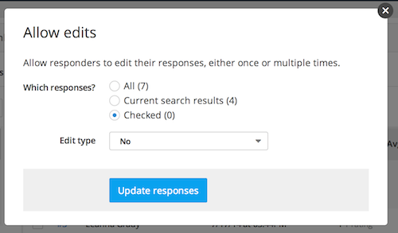

## Allowing edits to responses

If you'd like your responders to be able to edit their responses after they have submitted them, click "Allow edits" from the "more" dropdown above the "Responses" table. 

You can then allow edits for all responders (the "All" checkbox), for the responders displayed in the current search results (the "Current search results" checkbox), or for the responders you have selected by checking the box next to their name in the "Responses" table (the "Checked" checkbox).

After you have chosen which responses to enable for editing, select either "Yes" or "Once" from the "Edit type" dropdown. "Yes" will enable multiple edits, while "Once" will only allow the responder to edit their response one time. Then, click "Update responses" to save your configuration. Note that you can always go back and disable response editing by selecting "No" from the "Edit type" dropdown.