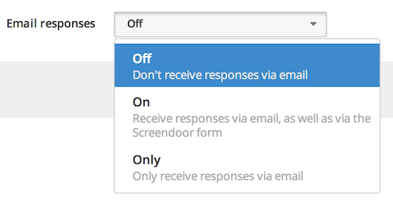
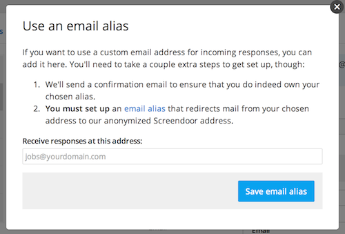

## Receiving responses via email

To receive responses via email, select the "Response via email" box on the "Settings" page for your project. Then, select the appropriate option from the "Email responses" dropdown.

After you have turned on email responses, configure how you'd like to map a response email to your specific project's form by selecting the appropriate field names under "Field mappings". For example, you might want to map the email's subject to the "Title" field in your project's response form. See the configuration below for a simple example, which might be used for an article submission project.

## Receiving responses with a custom address

If you would like to use a custom email address for incoming responses (instead of the default address, which is unique to your project and will look something like this: "sdp-response-UMtlSKkU@in.dobt.co"), you can set it up by clicking the "use a custom address" link on the "Respond via email" page. Follow the instructions listed on the "Use an email alias" popup, which include confirming your custom email address and setting up email forwarding from your custom address to the anonymized Screendoor address.

