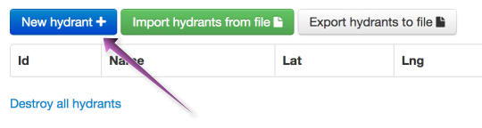
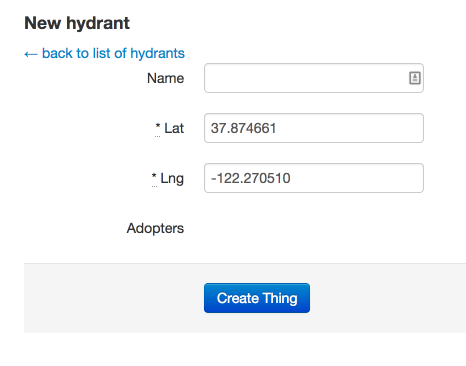
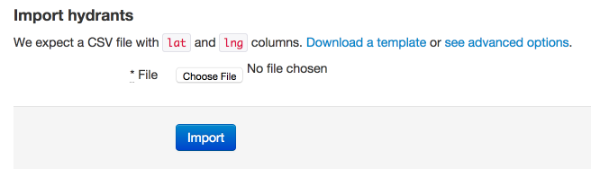

    **Note**: We'll be using "hydrant" as the example "thing," but replace this with whatever "Singular thing name" you set up when you [configured your site](configuring_your_site.html#basic-info).

To add some adoptable hydrants, click the "Hydrants" link.

### Adding hydrants manually

To manually add a hydrant, click the "New hydrant" link from the "Hydrants" page

Then, fill in the latitude and longitude of your hydrant's location, and an optional name for your hydrant.

Click "Create Thing" to add your hydrant to the map.

### Importing hydrants from a CSV file

To import your hydrants from a CSV file, click the "Import hydrants from file" button. Then, click the "Choose File" button and select your CSV file. Click "Import" to import your CSV file into Adopta.

Here's an example of a simple CSV file that you can use to import hydrants:

    lat,lng
    37.875271,-122.271025
    37.875271,-122.261025

You can also include the `name` header:

    lat,lng,name
    37.875271,-122.271025,some hydrant
    37.875271,-122.261025,another hydrant

> **Advanced feature**: If you add an `id` header and specify an `id` for some of your CSV rows, Adopta will look for an existing hydrant with a matching `id`. If it finds one, it will overwrite its name, latitude, and longitude with the values defined in your CSV file.

### Viewing your added hydrants

Once you've added some hydrants, view them on your Adopta site by clicking the "View site" link.

