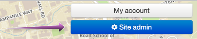
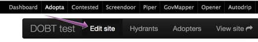
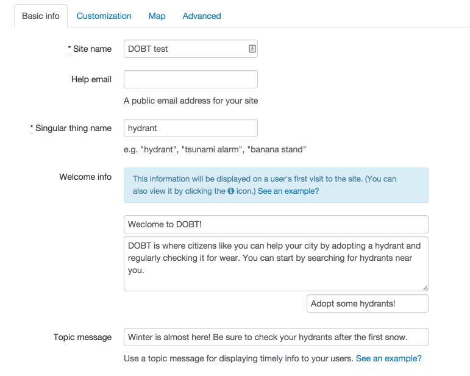
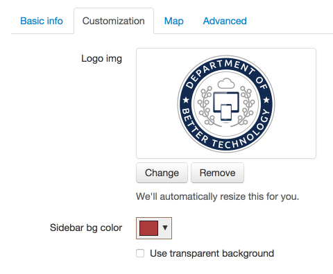
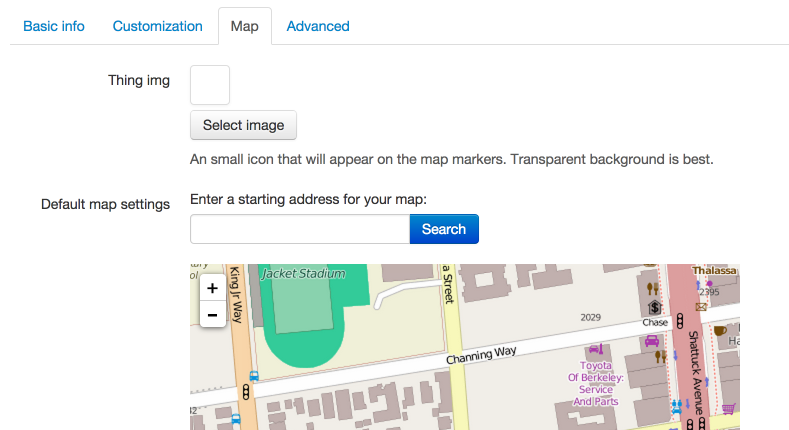
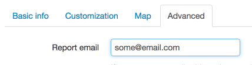

To get started with Adopta, [launch the app](/articles/your_account/dashboard/managing_applications.html#launching-an-application) from your DOBT Dashboard. Then, click the "Site admin" button to configure your Adopta site.

Click the "Edit site" link to set up how your Adopta site will appear to the public.

### Basic info

From the "Basic info" tab, make sure to set a "Site name" and "Singular thing name" (e.g., "hydrant"). You can also set a "Help email" (which will be publicly visible on your site), some "Welcome info," and a "Topic message."

    **Note:** Make sure to click the "Update Site" button after making changes to your site.

### Customization

From the "Customization" tab, you can set a logo image that will be displayed on the upper right side of your map. You can also set a background color for the sidebar on your map.

### Map

From the "Map" tab, you can set a "thing" image (e.g., an image of a hydrant) that will appear on your map markers. You can also set a default starting point for your map.

### Advanced

Under the "Advanced" tab, you can set a "Report email." This will allow users to report problems with specific "things" (e.g., hydrants). These reports will be sent to this email address.

