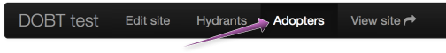
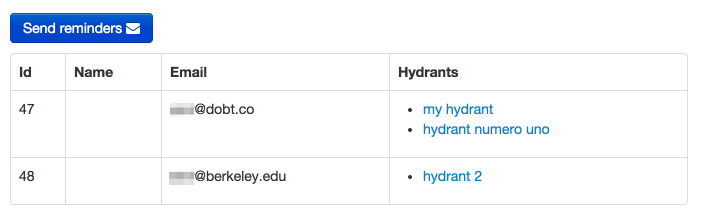
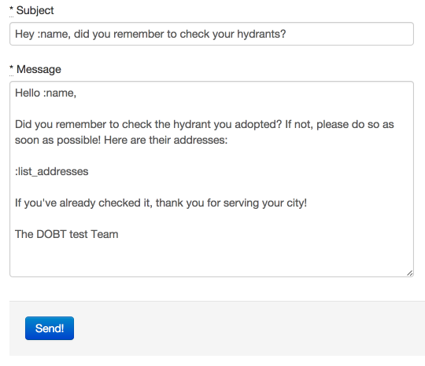

View all the adopters (people who have adopted things) for your site by clicking on the "Adopters" navigation link.

You should see a list of all the adopters for your site (if there are any).

To send a remainder message to all your adopters, click the "Send reminders" button. You can modify the default message, or write your own from scratch.

> Note that you can use `:name` for the adopter's name and `:list_addresses` for a list of the names and addresses of their adopted things.

Click "Send!" and confirm to send your message to all your adopters.
