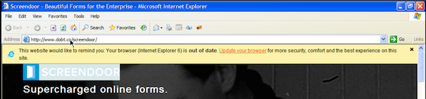

DOBT's applications are designed to support the latest web browsers.

If you are having browser trouble with any of our apps, please try upgrading your browser (if possible).

We recommend using Google Chrome. It is fast and automatically keeps itself up to date. We also support the current versions of Safari, Firefox, and IE 9+. Please note that IE9 may not support all of our features, and users are encouraged to upgrade to at least version 10.
