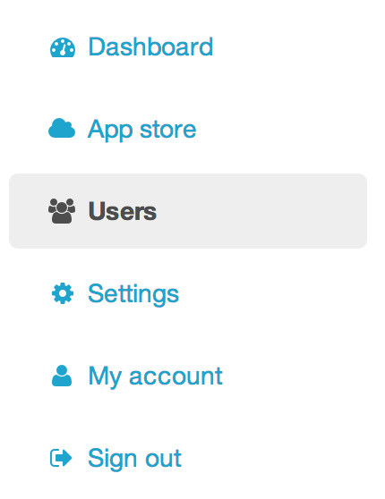
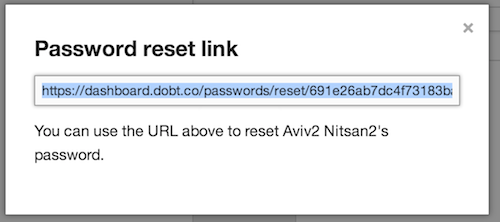

## Inviting new users

If you are an administrator in your organization, you will be able to add users from the "Users" section of the dashboard. Simply click the  button and then fill out the form.

## Managing user permissions

When you add a user, you can choose the appropriate permission level for that user with the "Permission level" dropdown on the "invite user" page. However, you can also change an existing user's permission level. Just select the user you would like to manage from the "Users" section of the dashboard and then select the appropriate permission level from the dropdown on the user page.

## Resetting a user's password

To reset a user's password, click the "Get password reset link" link from the user page. You can copy the provided link, send it to the user, or paste it into your browser to begin the password reset process.

## Removing users

To remove a user, just click the "Remove from staff" link at the bottom of the user page. You will be prompted to confirm that you want to remove that user.
