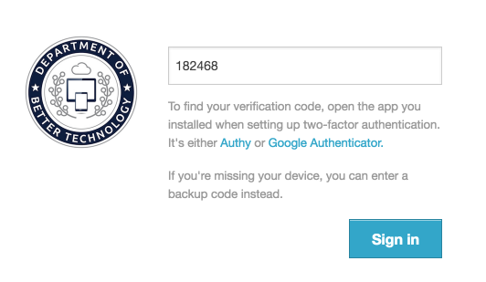

Make your account more secure by requiring an extra step for authentication. All you need is a cell phone and an application on your computer or mobile device.

## Enabling two-factor authentication

To enable two-factor authentication for your DOBT account, go to the "My account" tab on the DOBT Dashboard. Under "Two-factor authentication," click the "Enable?" link.

### Using the Authy Smartphone app

To use Authy for two-factor authentication from your smartphone, download the Authy app. When your first launch it, you'll have to enter your phone number and email address. Verify your account by sending an SMS and then entering the registration code from that SMS into Authy.

Next, add an "authenticator account" by pressing the plus button. Scan the QR code displayed on the DOBT Dashboard (or enter the code manually), enter "DOBT" as your account name, and press "Done." Next, enter the validation code from Authy into the DOBT Dashboard and click "Verify device." You should now see the "You've enabled two-factor authentication!" page. Make sure you write down your backup codes, so you can access your account if you lose your phone.

### Using the Authy Chrome app

The easiest way to use two-factor authentication without a smartphone is with the Authy Chrome app.

[Download Authy](https://chrome.google.com/webstore/detail/authy/gaedmjdfmmahhbjefcbgaolhhanlaolb) and set it up by entering your phone number. Then, verify your phone number by sending an SMS and then entering the registration code from that SMS into Authy.

Next, set up a master password for Authy under the "Account" tab.

Now that your Authy account is set up, click "Add Authenticator Account" and enter the code displayed under step 2 from the DOBT Dashboard (it will be something like `xrijdtj44fdc26tdopxpg6yt`). Click "Add Account," select a logo, and enter "DOBT" for the account name. You should now see a "DOBT" account under "External Accounts" in Authy.

To finish setting up two-factor authentication for your DOBT account, close the main Authy window. You should then see a smaller Authy window: click "DOBT" and then "Copy" to copy your validation code. Enter that code into the DOBT Dashboard and click "Verify device." You should now see the "You've enabled two-factor authentication!" page. Make sure you write down your backup codes so you can access your account if you lose your phone.

## Signing in with two-factor authentication enabled

To sign in to your DOBT account with two-factor authentication enabled, enter your email and password as you normally would. Then, open Authy (if you're using the Chrome app, you'll have to enter your master password), click "DOBT," and copy your verification code. Next, enter that verification code into the DOBT Dashboard page and click "Sign in."

