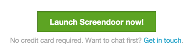
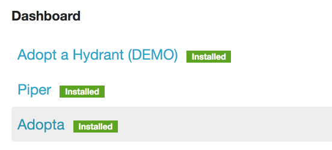

## Installing an app

To install an app, navigate to the "App store" section of the dashboard. Select the app you would like to install and then click the "free trial" button at the bottom of the app page. You will then be prompted to install the app you selected.

## Launching an app

To launch an app, just click the app name from the Dashboard.

## Changing an app's URL or slug

To change an app's URL (slug), click the "Admin" link to the right of the app listing on the "Dashboard" page. Then, click the "Change" button next to the URL. Enter a new slug, and then click the "Save" button. Note that your slug must be unique, and that if it is already taken you will have to find another one.

## Adding or changing your plan

From the "Dashboard" section, select the app you would like to configure. Then, click "Change plan" under "Plan" to add or change a plan. See the [Organization settings](../accounts/organization_settings.html) article for more information on billing and subscription.

## Removing an app

To remove an app, click the "Disable" link to the right of the app on the "Dashboard" page.
