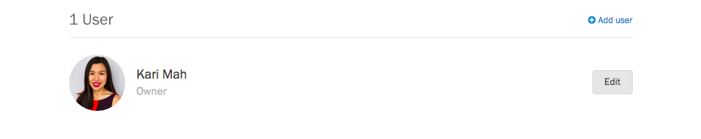
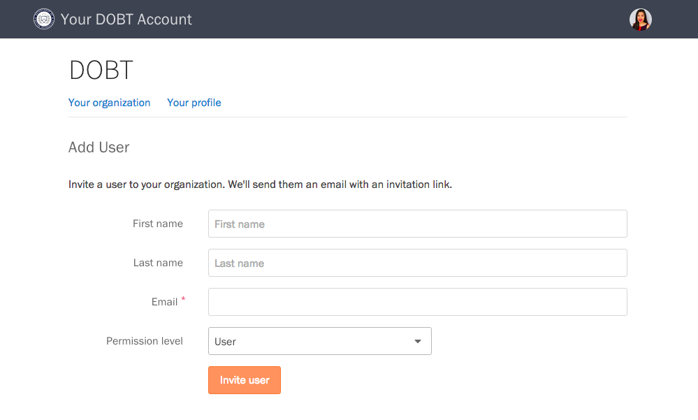

    **Note**: If you have a Screendoor account, manage your users by [following the instructions here](../../screendoor/your_account/managing_users.html).

### Inviting new users

If you are an admin for your organization, you can add users from the ["Your organization" page](https://dashboard.dobt.co/organization/). Scroll down to the Users section, and press the "Add user" button.

Fill out the form, press the "Invite user" button. The invited user will receive a link to sign up for a DOBT account, after which they will be added to your organization.

### Managing user permissions

When you add a user, you can choose the appropriate permission level for that user from the "Permission level" dropdown on the "Add User" page.

To manage permissions for an existing user, select the user from the ["Your organization" page](https://dashboard.dobt.co/organization/). Then, choose a permission level from the "Permission level" dropdown. For app-specific permissions, select the appropriate permissions under "App permissions."

### Resetting a user's password

Point the user to the [Signing in](signup_and_login.html) article, or have them email us at [support@dobt.co](mailto:support@dobt.co?subject=Reset password request).

### Removing users

On the "Your organization" page, click on the user you'd like to remove. On the bottom of that user's page, click the "Remove from staff" link, and confirm you want to delete that user in the modal dialog that appears.

