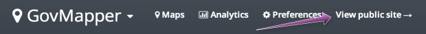
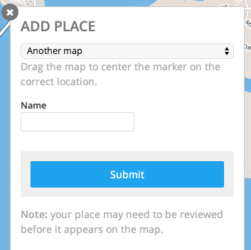
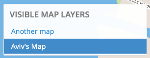
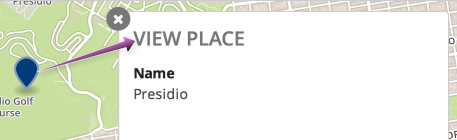
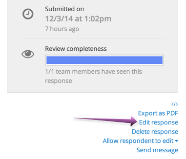

To view your map, click the "View public site" link from the GovMapper admin navigation bar.

This will take you to your publicly-viewable GovMapper site.

## Adding a place

To add a place from a GovMapper site, click the "Add a place" button and drag the map around to select the correct location. Then, select the appropriate map from the dropdown, fill out the response form, and click "Submit"

## Toggling map layers

Click a map layer under "Visible map layers" to toggle whether it's displayed on the map or not. Map layers with a dark background are visible.

## Viewing details for a place

To view details for a place, click its place marker on the map. 

## Editing a place

To edit a place, click its place marker on the map. Then, click the "View on Screendoor" link.

> Note: This link will only appear if you're logged in and have the appropriate permissions.

This will take you to the Screendoor response page for the place you selected. To edit the place, click the "Edit response" link below the sidebar on the right-hand side of the page.

