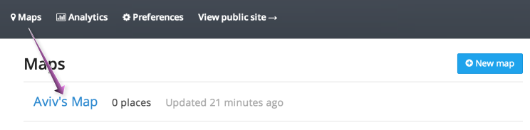
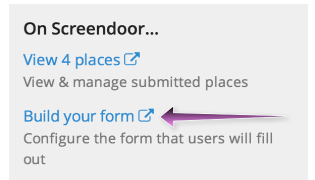
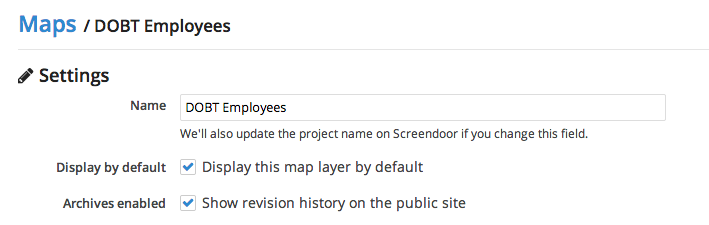
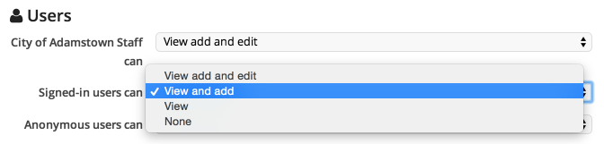
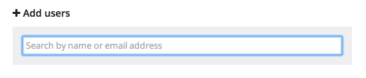
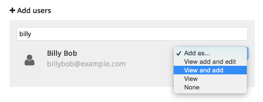
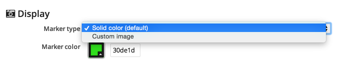
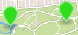
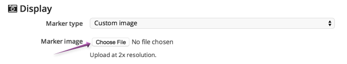

To configure your map, click its name under the "Maps" section of GovMapper.

### Configuring your response form

To configure your response form (i.e., the form that users will fill out when adding a place), click the "Build your form" link from the "On Screendoor..." sidebar. This will take you to Screendoor's form builder, where you can [build your response form](/articles/screendoor/your_form/building_your_form.html) as you would for any Screendoor project.

    **Note**: Data for any response field not marked as "admin only" will be displayed publicly on your map.

### Editing your map's settings

To change your map's name, edit the name under "Settings."

You can also choose to display your map by default so that new users to your site will not have to [click on the name of your map](../public_site/viewing_your_site.html#toggling-map-layers) to see it.

If "Show revision history on the public site" is checked, users will be able to see the same response history that is available to admins on Screendoor.

### Managing permissions

To manage permissions for your map, you can select a permission level for each user group.

You can also set a permission level for individual users once you've added them.

### Adding users

To add a user to your map, start typing their name or email address in the search box under "Add users."

If the person you're searching for has a Screendoor account and belongs to your organization, they will appear in the search results and you can add them immediately. Make sure to select the appropriate permission level from the dropdown.

You can also add users who are not yet registered with your organization. Enter their name and email address, select a permission level, choose whether or not to add them to your organization, and click "Send invite."

### Configuring map markers

Your markers can be either a solid color or a custom image. From the "Marker type" dropdown, select "Solid color" or "Custom image."

If you chose "Solid color," you can pick a custom color by clicking the color picker under "Marker color" and selecting a color. This is what the markers will look like in a solid color:

If you chose "Custom image," pick your image by clicking "Choose File" and selecting an image to upload.

    **Note**: Upload at "2x resolution" to ensure your map marker will display correctly on retina displays. For example, if you want to display your marker image at 256x256 pixels, upload your image at 512x512 pixels.

