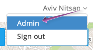
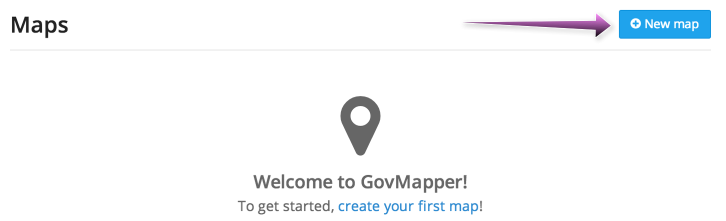
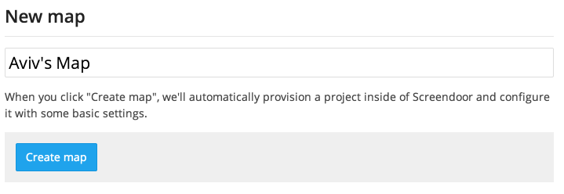

To get started with GovMapper, [launch the app](/articles/your_account/dashboard/managing_applications.html#launching-an-application) from your DOBT Dashboard. Then, click &ldquo;Admin&rdquo; in the user menu to configure GovMapper.

Click the &ldquo;New map&rdquo; button.

Choose a name for your map and click &ldquo;Create map&rdquo; to create your map.

This will create both a GovMapper map and an associated Screendoor project. While you'll configure and manage your map from GovMapper, you'll manage all the places (i.e., location points) as responses in the associated Screendoor project.

Now that you've created your map, you can [configure it](configuring_your_map.html) or [manage its places](managing_places.html).

    **Note**: You can have multiple maps for one GovMapper site. Each will appear as a separate "map layer" on your site.

