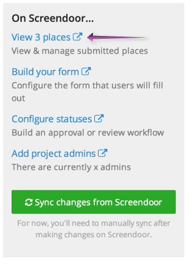
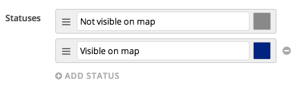
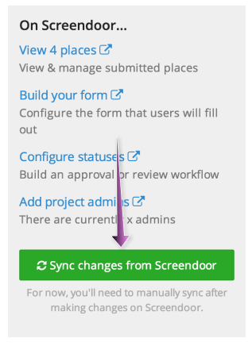

GovMapper retrieves the places (location points) for your map from responses to its associated Screendoor project, so you can manage these places in the same way you'd manage any Screendoor responses.

> Note that each "map" on GovMapper corresponds to a separate Screendoor project

## Viewing and managing submitted places

To view submitted places for a GovMapper map, click "Maps" from the GovMapper navigation menu and select the appropriate map. From the map page, click the "View places" link from the "On Screendoor..." sidebar to view and manage submitted places in Screendoor.

This will take you to the "Responses" page for the Screendoor project associated with your GovMapper map. From here, you can manage responses just as you would for any other Screendoor project. See the [Screendoor](/articles/screendoor) articles for more information.

## Configuring statuses

Click the "Configure statuses" link from the "On Screendoor..." sidebar to configure an approval and review workflow for your places. By default, your project will only have one status ("Visible on map"). This means that any response that is submitted will immediately be shown on your map. If you'd like to review responses before displaying them on your map, create another status (e.g. "Not visible on map") and make it the default status by dragging it to the top of the statuses list.

> Note: DO NOT delete or rename the default status. Only responses with a status of "Visible on map" will be displayed on the map.

Check out the [Using statuses](/articles/screendoor/projects/using_statuses.html) article to learn more about Screendoor statuses.

## Syncing changes from Screendoor

Note that whenever you make changes to your Screendoor project, you'll have to click the "Sync changes from Screendoor" button so that GovMapper will reflect these changes.

