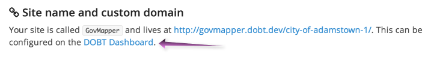
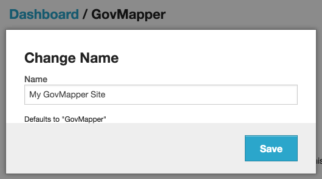
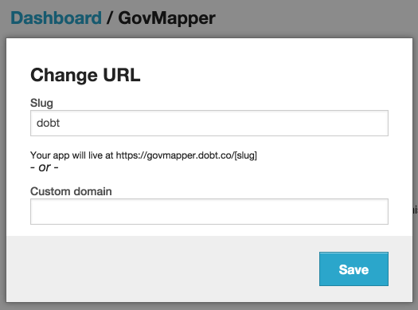
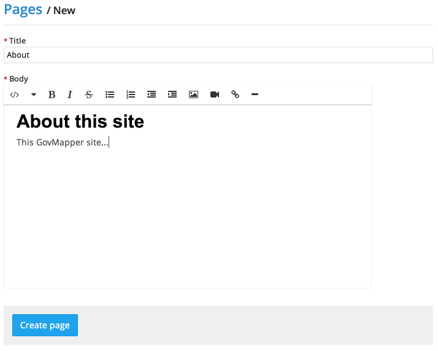
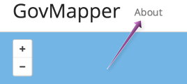
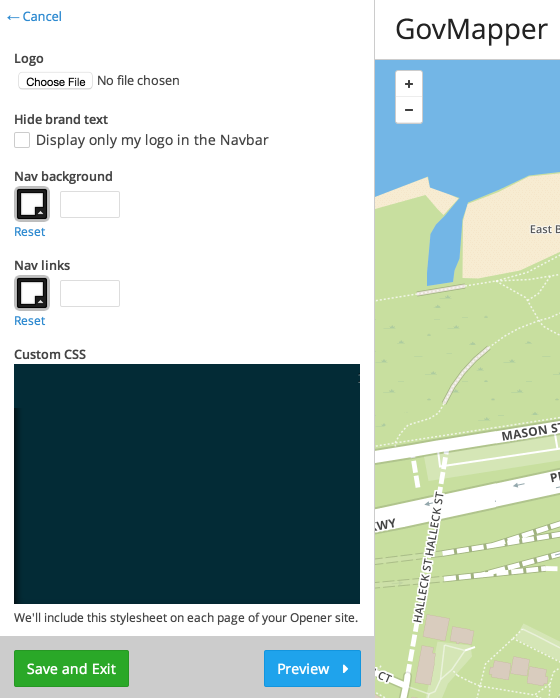

To set preferences for your site, navigate to the "Preferences" section.

### Changing your site's name or URL

To change your site name or URL, click the "DOBT Dashboard link" under "Site name and custom domain"

From the Dashboard, you can change your site name by clicking "Change" next to the "Name" field, entering a new name, and clicking "Save."

You can also change your site's URL, either to a different slug (e.g. `govmapper.dobt.co/your-slug-here`) or to a custom domain.

### Adding information pages

To add static information pages to your site, click "Add a page" under "Information pages." Enter a title and a body for your page and click "Create page" to create a new information page.

Your information pages will show up above your map. Clicking one will show it in a sidebar on the right side of the map.

### Customizing your site's appearance

To customize your site's appearance, click the "Customize" button under "Appearance." From the live preview page, you can add a logo (which will show up above the map and on the left side of the navigation bar), hide brand text (the "GovMapper" text that shows up above your map), set the navigation bar's background/link color, and even add your own custom CSS.

To use the live preview page, simply make changes on the left-hand side of the page and then click the "Preview" button to view them on the right. Feel free to play around with different options and preview them, as your customizations won't be saved until you hit the "Save and Exit" button.

### Setting a default map location

To set the default location for your map (which is what new users will see when they view your map), simply drag the map under "Default map location" to the appropriate point.

