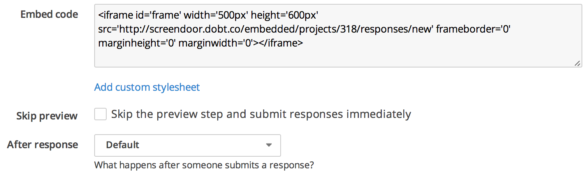

## Embedding the response form

Screendoor allows you to embed the response form for your project in your own website, making it even easier for responders to fill out your form. To embed the response form, click "Settings" from your project page and select "Embed code" from the boxes on the left-hand side of the page. Then, configure your embed code (add a custom stylesheet, skip the response preview, or configure what to do after the response has been submitted) and copy the HTML code under "Embed code" onto your own website.

<!-- Here is an example of a simple embedded response form for a live project:

<iframe id='frame' width='500px' height='600px' src='http://screendoor.dobt.co/embedded/projects/318/responses/new' frameborder='0' marginheight='0' marginwidth='0'></iframe>
-->

---

## Why does my embed code not work?
If you are seeing the "project not found" error when you try to embed your code, it's probably because your project is not live or it does not allow responses from unregistered users. To make your project live, click the "Go live" button from your project page. To allow responses from unregistered users, click "Edit project," select "Responses" from the "Project checklist," and uncheck the "Require responders to be registered on Screendoor" box.