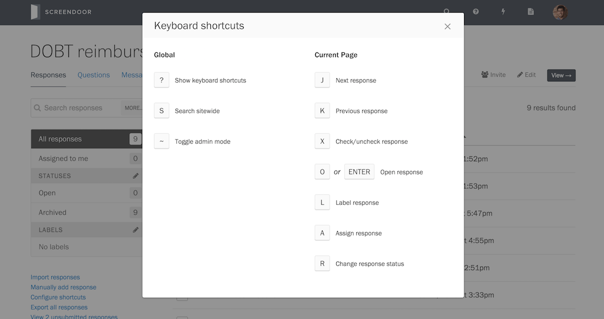

When working with large amounts of data, you can save time by learning Screendoor's keyboard shortcuts.

From any page on Screendoor, press the <code>?</code> key on your keyboard to see a list of available shortcuts:

