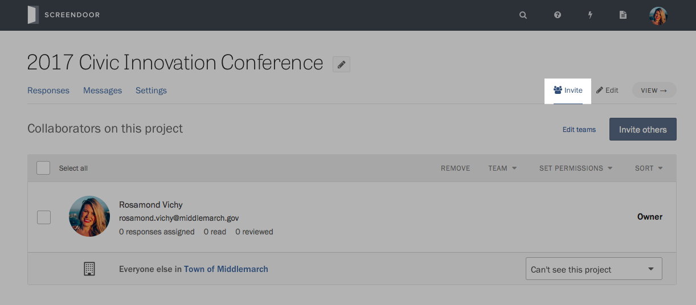
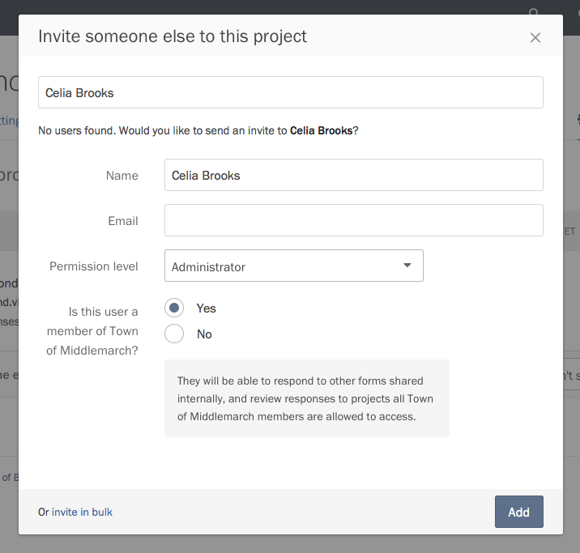

Screendoor really shines when you invite others to your projects. When everyone can see the newest submissions to your project, and the activity around them, your entire organization can stay in the loop, eliminating back-and-forth emails and generally making your team more efficient.

To start inviting colleagues to collaborate on your project, click on the Collaborators link on the right side of the project header.

### Inviting someone to collaborate

Press the &ldquo;Invite others&rdquo; button on the Collaborators page, and start typing the name or email address of the person you wish to invite.

By default, Screendoor assumes you're inviting someone who already has an account with your organization. If we find them, we'll show their name and avatar for you to add easily. Just select the [permissions](permissions.html) you want them to have, and press the &ldquo;Add&rdquo; button.

If the person doesn't have an account with your organization, you will be asked to add their full name and email to invite them to Screendoor. You can also add them to your organization, which allows them to create and view other projects on your account.

Note that each new collaborator you add will count against your [plan limits](../plans_and_billing/limitations.html).

### Adding collaborators in bulk

If you need to invite many collaborators at once, Screendoor lets you send those invitations in bulk. Press the &ldquo;Invite others&rdquo; button on the Collaborators page, and click the &ldquo;invite in bulk&rdquo; link in the lower left-hand corner of the modal dialog.

Enter the email addresses of the collaborators you wish to invite, one collaborator per line. Press the &ldquo;Send invites&rdquo; button to send Screendoor invitations to the email addresses you listed.

### Inviting everyone in your organization

By default, members of your organization can't access the projects you create, unless you invite them. You can allow everyone in your organization to view responses, rate, or even adminster your project with the alert at the top of the Collaborators page.

On the right side of the &ldquo;Unless listed below&hellip;&rdquo; alert, above the table of collaborators, press the Change button. Select the permissions you want your organization to have by default, and press Save.

You can override these permissions on an individual basis. Just invite colleagues inside your organization to your project, and set their permission level manually.

### Removing collaborators

To remove a collaborator, check the box next to their name, and click the Remove link above the Collaborators table.

---

## F.A.Q.

### Can I organize collaborators into groups?
If you have a Standard plan or above, yes! [Learn more about teams on Screendoor.](teams.html)
