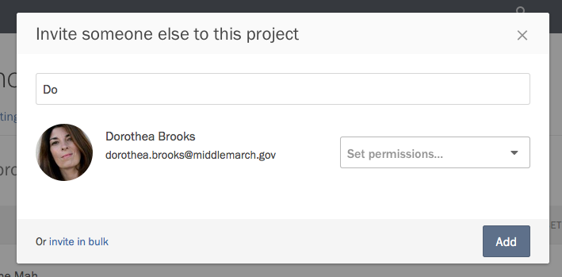
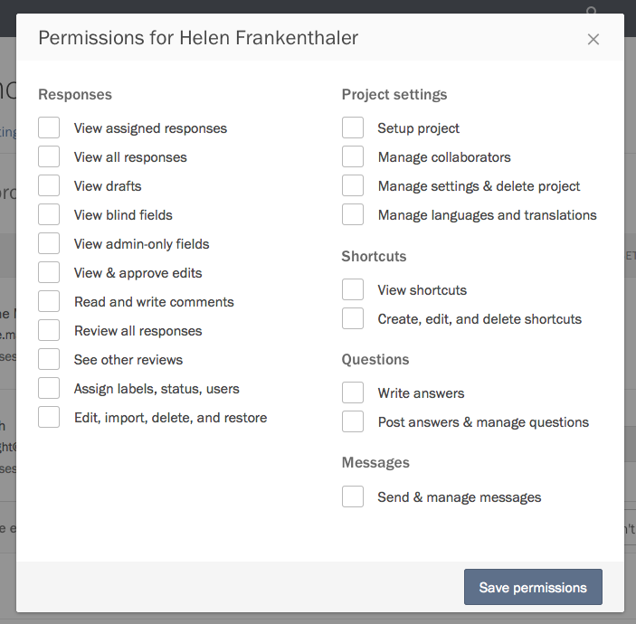

Permissions allow administrators to control which functionality collaborators can access in a Screendoor project.

### Permission levels in Screendoor

- **Owner**: The creator of a project is labeled as the project owner, who has the same privileges as an administrator. The permissions of the project owner cannot be changed or removed.

- **Administrator**: Administrators have all permissions, including the ability to invite new collaborators.

- **Full reviewer**: Users can view, comment on, and rate responses. They can also change the status, add labels, and assign users to a response.

- **Assigned reviewer**: Users can view, rate, and comment on *only* the responses assigned to them. They can't assign statuses or labels.

- **Observer**: Users can view responses, but they can neither rate nor manage them. They also cannot edit the project.

### Assigning permissions to collaborators

When a project owner or administrator invites a new collaborator, they must set that person's permission level before inviting them.

To change permissions for a collaborator after inviting them, visit the Collaborators page and scroll to their name. Use the dropdown to the right side of their listing to change their permission level.

### Custom permissions

Screendoor gives you the ability to configure more granular permissions for collaborators. When setting or changing someone's permission level, select the Custom option. A modal dialog will appear, through which you can enable and disable the specific functionality they can access.

To edit custom permissions after you have set them, press the Edit button to the left of the collaborator's permissions dropdown.

