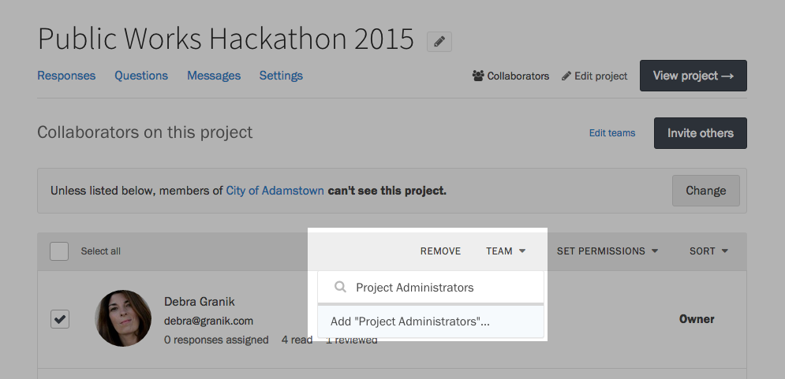

    **Note:** Project teams are only available to customers with a Standard plan or higher.

If you're a large organization using Screendoor, chances are you're delegating dozens of people from different departments to help evaluate your incoming responses. Screendoor's teams help you organize your collaborators and delegate work more efficiently.

### Adding a team

To start organizing your collaborators into teams, visit the Collaborators page for a project, and start selecting collaborators using the checkboxes on the left side of the table.

Select the "Team" button on the right, just above your list of collaborators, and start typing the name of the team you want to add them to. Select the &ldquo;Add&rdquo; option at the bottom of the dropdown to create a team with those collaborators. 

### Managing teams

If you want to delete or rename a team you have created, click the &ldquo;Edit teams&rdquo; link on the upper right-hand side of the page, and click one of the links to the right side of the team's name.

### Moving collaborators between teams

To move a collaborator to a different team, visit the Collaborators page, select the collaborator, and press the &ldquo;Team&rdquo; button, just like you would when adding a team. In the dropdown, choose the team you would like to reassign them to.

### Assigning work to teams

Screendoor lets you assign responses to teams you have created. Let's say you have 60 colleagues collaborating on a civic hackathon: 20 engineers who serve as technical experts, 20 project administrators, and 20 additional support staff. When it's time for an entry to undergo a technical review, you can assign the entire team to that entry, instead of manually assigning all 20 tech experts.

If you place someone in a team accidentally, and then assign responses to that team, it's still an easy mistake to fix. When you change the team someone is a part of, the responses they're assigned change as well.

You can also [add rating fields](/articles/screendoor/evaluation/setting_up_ratings.html) that can only be seen by a single team. When adding a rating, click the &ldquo;Show to&hellip;&rdquo; link, and select a team under the dropdown that appears.

