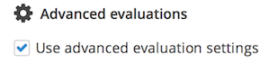
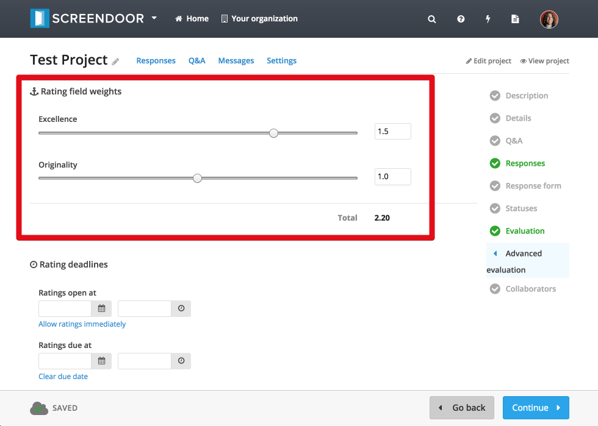
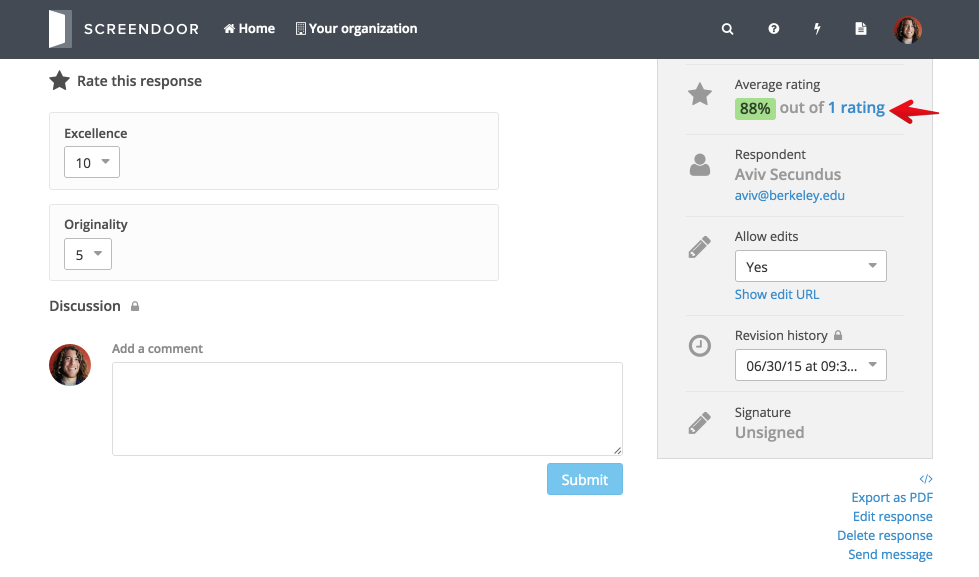
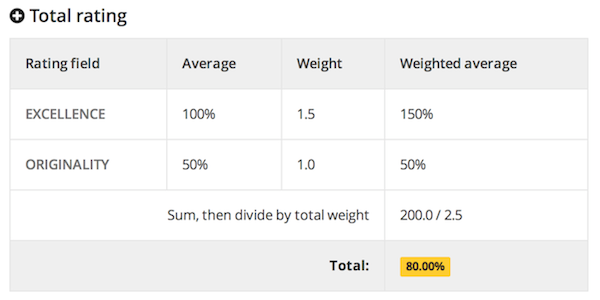
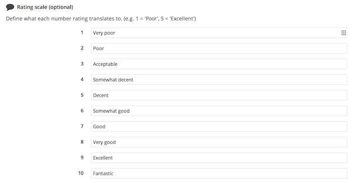
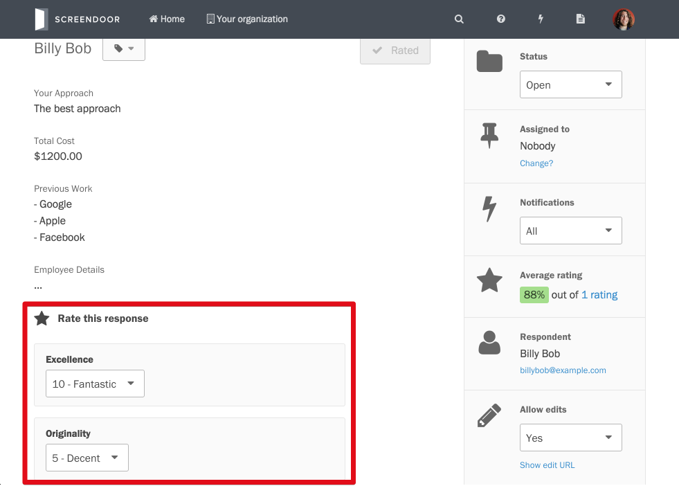
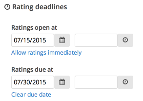

To enable advanced evaluation settings, click "Edit project" and select "Evaluation" from the "Progress" menu. Then, check the "Use advanced evaluation settings" box.

Once you check this box, a new "Advanced evaluation" section will show up under the "Progress" menu just under "Evaluation." From the "Advanced evaluation" page, you can configure several advanced evaluation settings.

## Rating field weights

You can decide what percentage of the total rating will come from each rating field. For example, if you want to weigh "Excellence" more heavily than "Originality," you can give it a higher weight. Click "Edit weights" to edit your rating field weights, set them up how you want, and click "Save weights" to save your changes.

> **Note**: The total weight must always add up to 100.

If you then rate a response's originality at 5 (out of 10) and its excellence at 10 (out of 10), you will get an average rating of 88% (rather than 75%, as it would be without any weighting). To see details about a weighted rating, simply click the link under "Average rating" on the right-hand side of an individual response page.

From this ratings page, you'll see a breakdown of how Screendoor calculates weighted ratings.

## Rating scale

You can optionally configure a label for each rating number in order to specify what that number designates.

When evaluators rate responses, these labels will show up next to their numbers on the response page.

## Rating deadlines

You can also optionally configure a date when evaluators will be able to begin rating responses. This can be useful if you want to make sure that evaluators do not rate responses until they have been completed. If you set a date, but then later decide that you want to allow ratings immediately, simply click the "Allow ratings immediately" link.

If you want to make sure that evaluators submit their ratings by a specific date, you can set up an optional ratings due date by selecting the appropriate date from the date/time picker. If you later decide to remove the due date, just click the "No due date" link.

