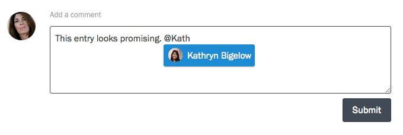

If you want to ask your colleagues' feedback on a response, or give your own feedback that doesn't quite fit inside of a rating, comments are a great way to do that.

To comment on a response, visit your project's Responses page, and click on a response in the table to view it. Scroll to the bottom of the page, enter your comment in the box provided, and press the Submit button.

You can also mention your fellow [collaborators](/articles/screendoor/collaboration/collaborators.html) in a comment. Type the `@` symbol, and then start typing their name. Select the appropriate collaborator from the dropdown. Unless that person has chosen to ignore the response you're commenting on, they will be notified of your comment.

    **Note**: You will only be able to mention collaborators [who are permitted](/articles/screendoor/collaboration/permissions.html) to read and write comments.

