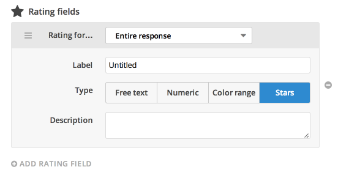
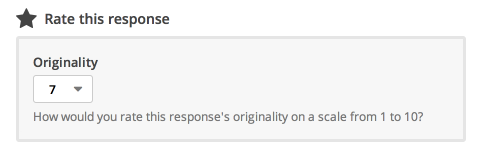
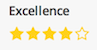
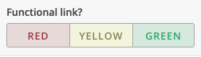
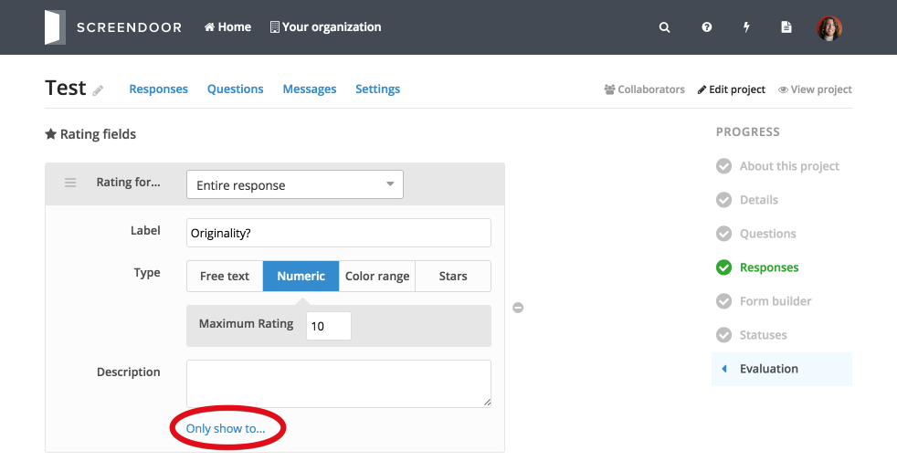
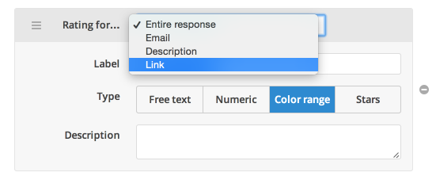
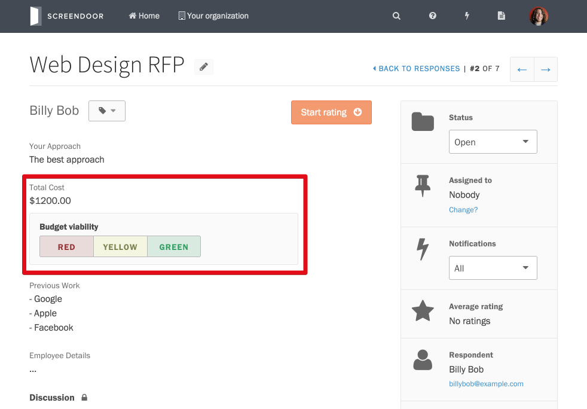

Screendoor gives you powerful and configurable tools to collaboratively rate and evaluate responses.

## Configuring rating fields

Evaluations in Screendoor are based on "rating fields," which are simply criteria by which to rate a response. For example, let's say that you wanted to rate a response's originality. Just click "Edit project" and select "Evaluation" from the "Progress" menu. If your project has any rating fields already set up, you'll see them here. To add a rating field, click "Add rating field."

Let's make this rating field numeric and call it "Originality."

Now that the "Originality" rating field has been added, it's easy to rate and evaluate responses according to their originality. From an individual response page, you (and your collaborators) can simply rate the response's originality under "Rate this response."

## Rating field types

Screendoor allows you to configure your evaluations with a variety of rating field types. There are several rating field types in addition to the "numeric" type:

-  &nbsp;&nbsp;Stars

-  &nbsp;&nbsp;Color range

-  &nbsp;&nbsp;Free text

## Segmented review

If you'd like to only show a rating field to a specific team (you'll have to [configure teams](/articles/screendoor/projects/teams.html) for your project first), click the "Only show to..." link for that rating field and select the appropriate team from the dropdown. Any collaborators who aren't on that team won't be able to see that rating field or evaluate based on it.

## Advanced evaluation settings

To enable advanced evaluation settings (weighted fields and deadlines), check out the [Advanced evaluation settings](advanced_evaluation_settings.html) article.

---

## F.A.Q.

### How do I connect a rating field to a response field?
To associate a rating field with a specific response field, select the appropriate response field from the "Rating for..." dropdown.

After you connect a rating field to a response field, the rating will show up next to the response field (rather than under "Rate this response") when you evaluate responses.

