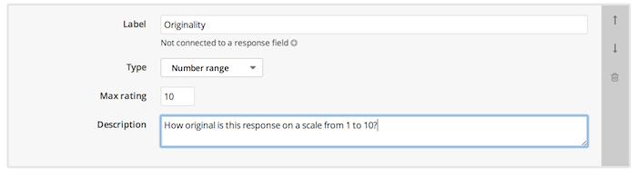
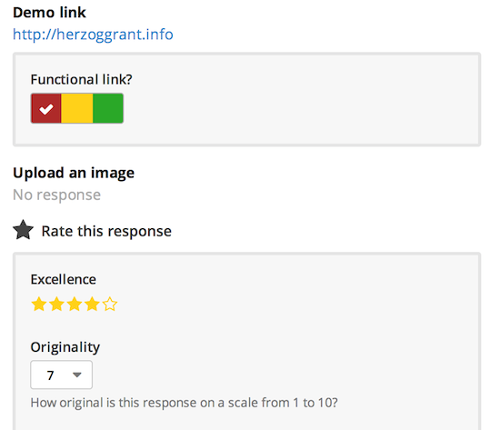

Screendoor gives you powerful and configurable tools to collaboratively rate and evaluate responses.

## Configuring rating fields

Evaluations in Screendoor are based on "rating fields," which are simply criteria by which to rate a response. For example, let's say that you wanted to rate a response's originality. Just click "Edit project" and select "Evaluation" from the project checklist to get to the evaluation section of your project. If your project has any rating fields already set up, you'll see them here. To add a rating field, click "Add rating field."

Let's call this rating field "Originality" and set it up to use a number range up to 10.

Now that the "Originality" rating field has been added, it's easy to rate and evaluate responses according to their originality. From an individual response page, you (and your collaborators) can simply rate the response's originality under "Rate this response."

## Rating field types

Screendoor allows you to configure your evaluations with a variety of rating field types. There are several rating field types in addition to the "Number range" type:

-  &nbsp;&nbsp;Stars

-  &nbsp;&nbsp;Red/yellow/green

-  &nbsp;&nbsp;Free response

## Advanced evaluation settings

If you want to enable advanced evaluation settings like weighted rating fields, check out the [Advanced Evaluation Settings](advanced_evaluation_settings.html) article.

---

## How do I connect a rating field to a response field?
To associate a rating field with a specific response field, click the plus icon next to the text "Not connected to a response field" and then select the appropriate response field from the dropdown.

After you connect a rating field to a response field, the rating will show up next to the response field (rather than under "Rate this response") when you evaluate responses.

