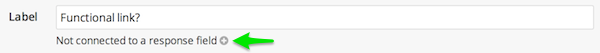

Screendoor gives you powerful and configurable tools to collaboratively rate and evaluate responses.

## Configuring rating fields

Evaluations in Screendoor are based on "rating fields," which are simply criteria by which to rate a response. For example, let's say that you wanted to rate a response's originality. Just click "Edit project" and select "Evaluation" from the project checklist to get to the evaluation section of your project. If your project has any rating fields already set up, you'll see them here. To add a rating field, click "Add rating field."

Let's call this rating field "Originality" and set it up to use a number range up to 10.

Now that the "Originality" rating field has been added, it's easy to rate and evaluate responses according to their originality. From an individual response page, you (and your collaborators) can simply rate the response's originality under "Rate this response."

## Rating field types

Screendoor allows you to configure your evaluations with a variety of rating field types. There are several rating field types in addition to the "Number range" type:

-  &nbsp;&nbsp;Stars

-  &nbsp;&nbsp;Red/yellow/green

-  &nbsp;&nbsp;Free response

## Advanced evaluation settings

To enable the advanced evaluation settings, check the box under "Advanced evaluations."

Once you check this box, a new "Advanced Evaluation" section should show up in the "Project checklist" just under "Evaluation." From the "Advanced Evaluation" page, you can configure several advanced evaluation settings.

#### Rating field weights

You can define a weight (also known as a multiplier) for your rating fields. For example, if you wanted to weigh "Excellence" more heavily than "Originality," you could configure your rating fields accordingly:

If we then rate a response's originality at 5 (out of 10) and its excellence at 10 (out of 10), we will get an average rating of 80% (rather than 75%, as it would be without any weighting). To see details about a weighted rating, simply click the link under "Average rating" on the right-hand side of an individual response page.

From this ratings page, you'll see a breakdown of how Screendoor calculates weighted ratings.

#### Rating scale

You can optionally configure a label for each rating number in order to specify what that number designates.

When evaluators rate responses, these labels will show up next to their numbers on the response page.

#### Rating deadlines

You can also optionally configure a date when evaluators will be able to begin rating responses. This can be useful if you want to make sure that evaluators do not rate responses until they have been completed. If you set a date, but then later decide that you want to allow ratings immediately, simply click the "Allow ratings immediately" link.

If you want to make sure that evaluators submit their ratings by a specific date, you can set up an optional ratings due date by selecting the appropriate date and time from the date picker. If you later decide to remove the due date, just click the "No due date" link.

---

## How do I connect a rating field to a response field?
To associate a rating field with a specific response field, click the plus icon next to the text "Not connected to a response field" and then select the appropriate response field from the dropdown.

After you connect a rating field to a response field, the rating will show up next to the response field (rather than under "Rate this response") when you evaluate responses.

