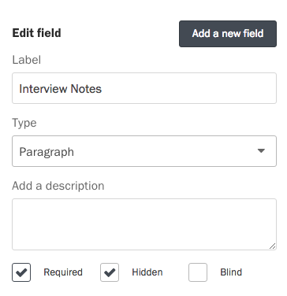

If you want to add notes to a response that don't require the input of your entire team and may be too complex for a status or label, try adding hidden fields to your form. Only your team will be able to see hidden fields. Think of it as the admin-only section of your form.

You can make any field of your form hidden in the [form builder](/articles/screendoor/your_form/building_your_form.html). Under the description in the left pane, select the "Hidden" checkbox to hide that field from respondents.

When responses are submitted, you can then [edit them](/articles/screendoor/responses/editing_responses.html) to complete the hidden fields in your form.
