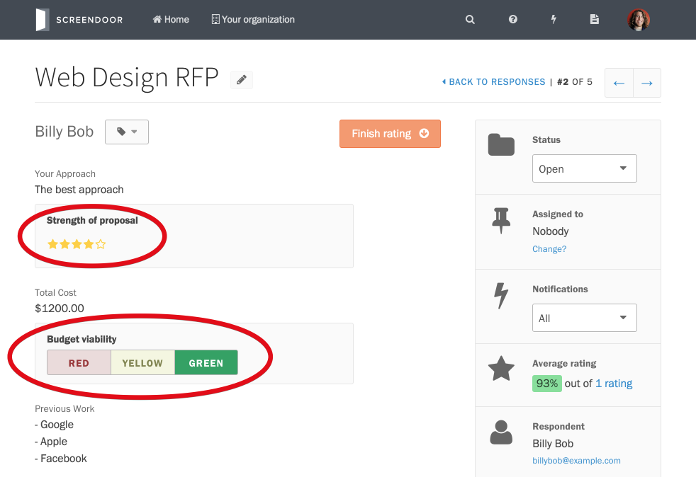
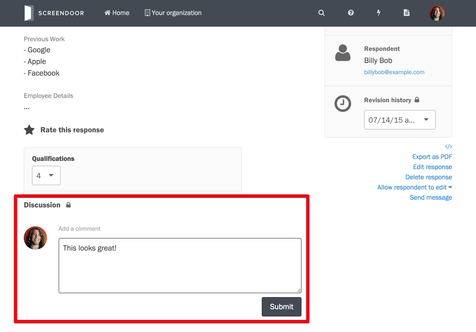
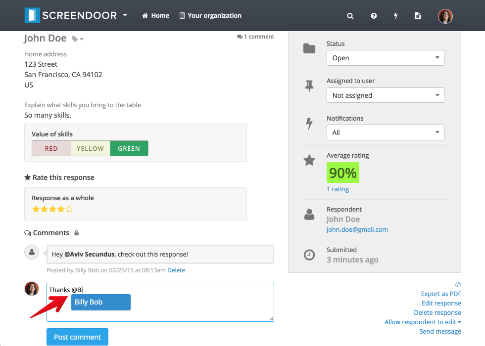

To view an individual response page, click on the appropriate response from the "Responses" page. From an individual response page, you can review, rate, and comment on that response.

## Rating a response

To rate a response, select or input an appropriate rating for any pertinent evaluation fields.

## Commenting on a response

To comment on a response, enter your comment and click the "Submit" button.

To bring a response to the attention of another collaborator in your project, you can @mention them in a comment. Simply type the '@' symbol and select the appropriate collaborator from the pop-up list. Unless the collaborator you @mentioned is ignoring that response, they will be notified of your comment.

    **Note**: You will only be able to mention collaborators who have the appropriate permissions.

