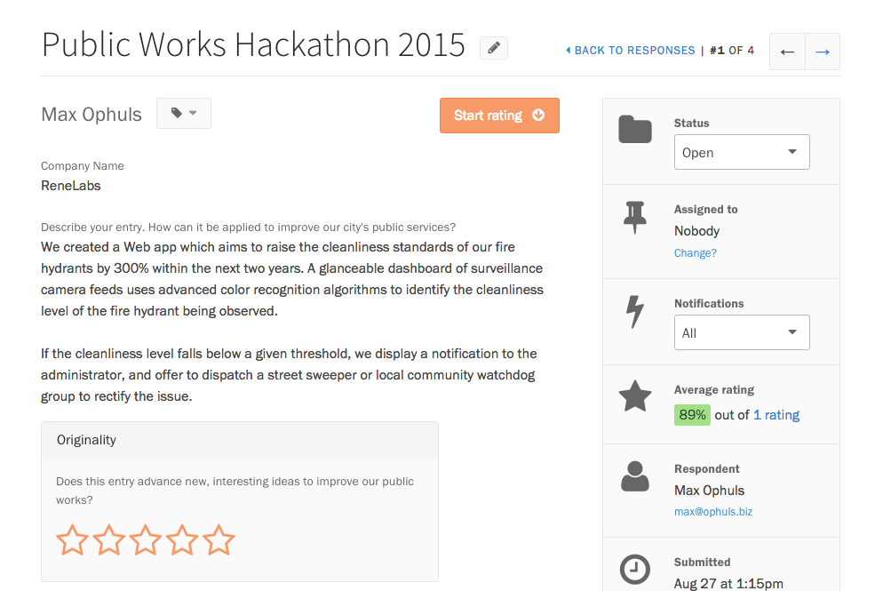
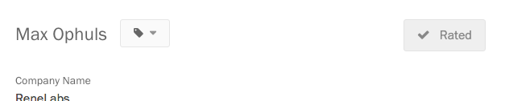
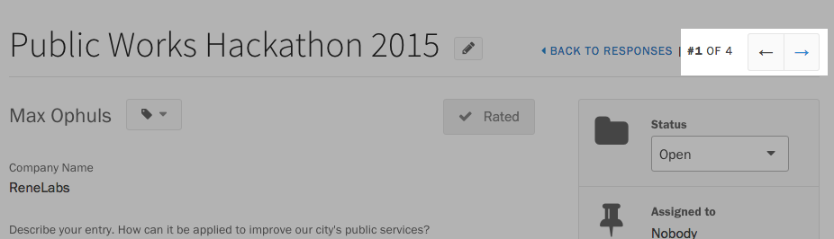

After you have [added rating fields to your project](setting_up_ratings.html), you and your [collaborators](/articles/screendoor/collaboration/collaborators.md) can start rating responses. To get started, visit your project's Responses page, and click on a response in the table to view it.

If you haven't yet rated a response, you can press the &ldquo;Start rating&rdquo; button in the page's header to take you to the first blank rating.

After you finish your first rating, keep scrolling down, filling out each rating as you arrive at them. For each rating field, choose a rating that best reflects your assessment of that response.

When you have completed all ratings for a response, the button in the header should change to read &ldquo;Rated&rdquo;.

If you still have ratings to complete, the button will ask you to finish rating. Pressing it will take you to the first rating you have left blank.

Once you're done rating, press the Previous or Next arrows in the header to move on to the next response.

