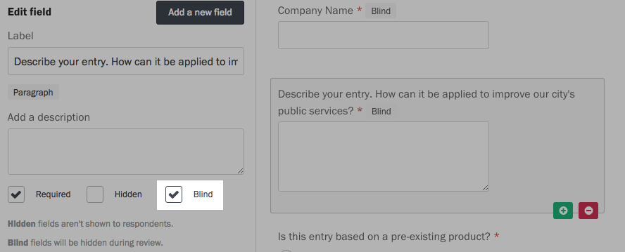

For applications, RFPs and other types of forms, you might want to ensure that you are judging candidates solely on their merits, rather than their demographics or financial background. With blind fields, Screendoor lets you anonymize anything in your form during the evaluation process, eliminating potential bias.

### Anonymizing names and email addresses

Click the &ldquo;Edit project&rdquo; link on the right side of the project header, and choose &ldquo;Responses&rdquo; from the Progress menu. Under &ldquo;Data collection&rdquo;, check the box &ldquo;Treat respondent names as blind fields&rdquo;.

### Anonymizing other form fields

Select &ldquo;Form builder&rdquo; from the Progress menu, and click on a field in the [preview pane](/articles/screendoor/your_form/building_your_form.html#getting-started) to edit it.

Under the description in the left pane, select the &ldquo;Blind&rdquo; checkbox to anonymize that field.

### Reviewing a project with blind fields

Reviewers you invite to your project will see that the answers to blind fields have been redacted.
