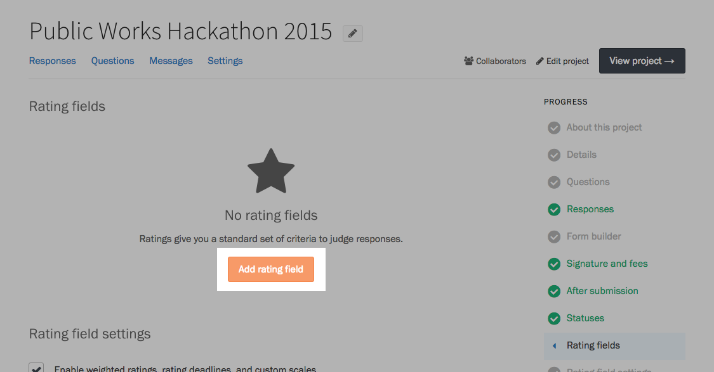
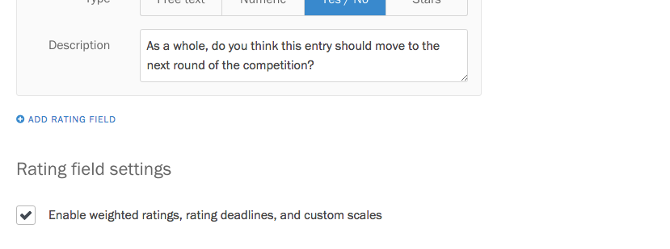
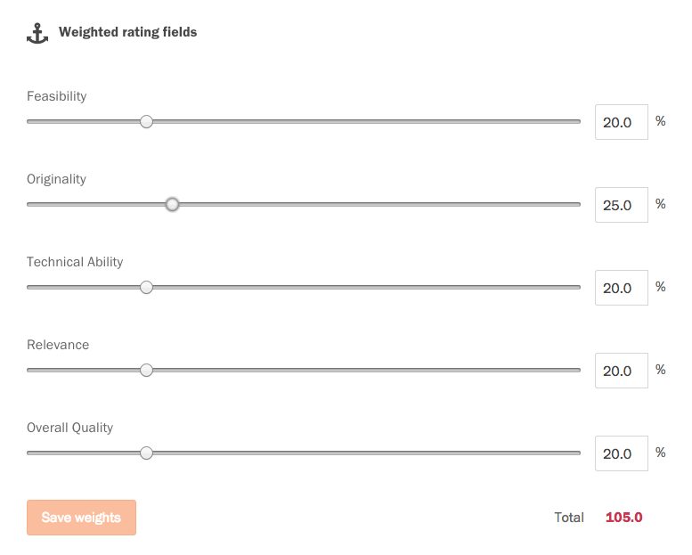

Screendoor really shines when it comes time to evaluate the responses you've received to your forms. Whether you're trying to review a job application, evaluate an RFP, or approve an open data set, ratings (along with [statuses](/articles/screendoor/responses/using_statuses.html) and [labels](/articles/screendoor/responses/using_labels.html)) help you stay organized and surface the best submissions.

### What does your team value?

To get started rating responses in Screendoor, you first need to define your rating criteria. Upon which metrics should each response should be judged? For example, if you're evaluating a job application, should you rate your job candidates on their skill set and past experience only, or should soft skills like culture fit also factor into your scoring?

Rating criteria, at their core, represent a set of values for your project: they detail the characteristics you collectively find important enough to judge, and those which won't factor into your decision. If you can, it's worth having a discussion with your colleagues about how best to evaluate your project. Arriving at a shared agreement around your team's values won't just be beneficial for your team. It will help you choose better responses, too.

### Adding a rating field

Once you have a set of rating criteria, it's time to add them as rating fields into Screendoor. Select the "Edit" link on the right side of the project header, and choose "Rating fields" from the Progress menu. Press the "Add rating field" button to get started.

Each rating field has a short title, as well as an optional description if you want to add more information.

There are four types of ratings you can add.

**Star ratings** let you rate a response between one and five stars.

**Yes / No ratings** let you answer a rating with a simple "Yes," "No," or "Maybe."

By default, **numeric ratings** let you rate on a scale of 1 to 10.

You can change the maximum rating when you set up the rating field.

**Free text ratings** allow your teams to provide subjective feedback on a response. Because free text ratings don't translate to a percentage, they won't be included in the response's average rating.

### Rating a specific form field

Screendoor usually assumes your rating criteria apply to the entire response. Unless configured otherwise, they are displayed at the bottom of the page.

You can also tie a rating criterion to a single form field. When adding a rating,  click on the dropdown under "Rating for&hellip;" and select the label of the form field you want to rate.

Ratings tied to a form field will appear directly under that field.

### Weighted ratings

All rating criteria are treated as equals in Screendoor when you create them. But if your team prioritizes some criteria over others, Screendoor's rating weights let you assign relative importance to each rating field.

To turn on weighted ratings, make sure you have added at least two non-"free text" rating fields to your project. Then, press the "Add weighed ratings" button under the "Rating field settings" section of the "Rating fields" page.

Press the "Edit weights" button to adjust the relative weights of each rating. For example, let's say we want "Originality" to have a slightly higher weight than "Technical Ability." We can adjust the slider on "Originality" until it has a weight of 25%.

Before you can save your rating weights, they must all add up to 100%. Adjust the other ratings until the total is correct.

When you're done, you must press the "Save weights" button to save your changes.

### Adding a start date and deadline for ratings

If you want your reviewers to submit their ratings within a certain period of time, you can add a start date and deadline for your reviewers to submit ratings.

Under the "Rating field settings" section on the "Rating fields" page, press the "Add a deadline for ratings" button. Use the date and time pickers to choose your start date and deadline.

If the rating period has yet to start, reviewers will be unable to add ratings. Similarly, if the deadline for rating has passed, reviewers will be able to see their previous ratings, but they won't have the ability to edit them or add new ones.

### Adding a custom scale to numeric ratings

Screendoor lets you add descriptions to your numeric ratings, so you can explain what each number in the scale represents.

If you have a numeric rating in your project, press the "Add a custom scale" button under the "Rating fields settings" section of the "Rating fields" page. Under "Custom rating scale," add descriptions next to each number.

When reviewers reach your numeric rating, they will see your custom description next to each number.

