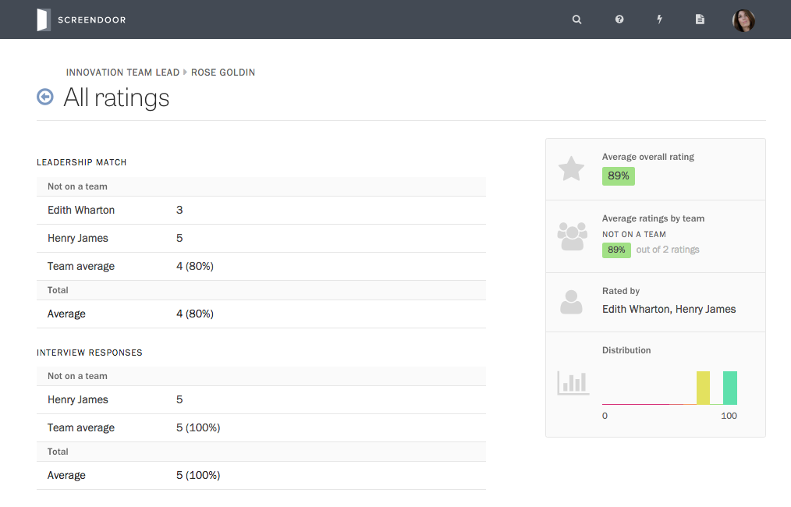
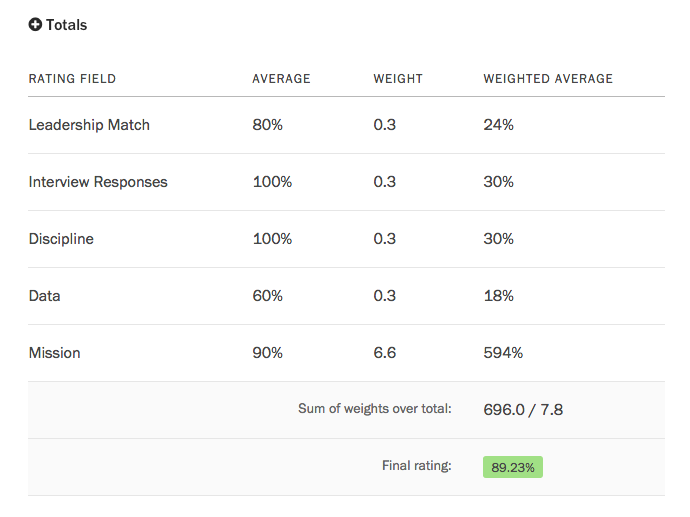

To view ratings submitted for an individual response, visit the Responses page and click on the response to see its detailed view. Then, in the right sidebar under "Average overall rating," click the "X rating(s)," where "X" is the number of [collaborators](../collaboration/collaborators.html) who have rated the response.

This link will take you to the "All ratings" page, which displays the ratings your collaborators have entered for a given rating field.

If you have organized your collaborators into [teams](../collaboration/teams.html), this page also shows you the average team rating for each rating field.

At the bottom of this page, you will find a table of the weighted average of each rating field and the "final rating"— that is, the total weighted average for the response. (The total average will be weighted if you have turned on [weighted ratings](../evaluation/setting_up_ratings.html#weighted-ratings) for your project.)

