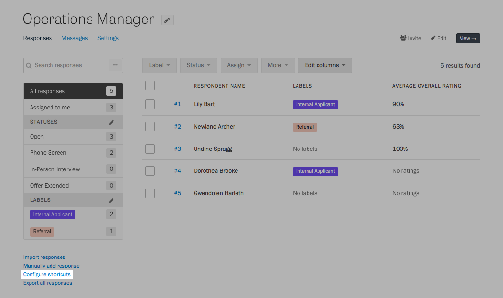
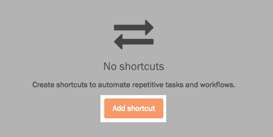
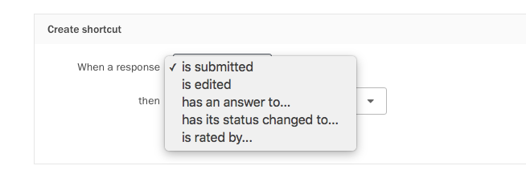
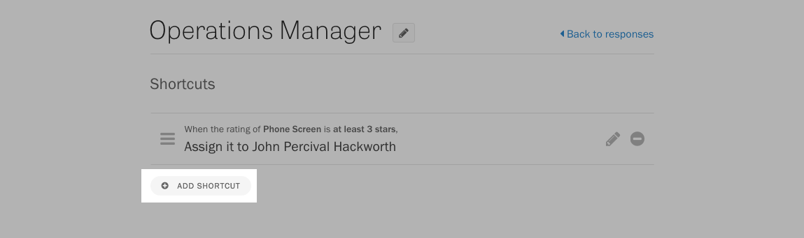
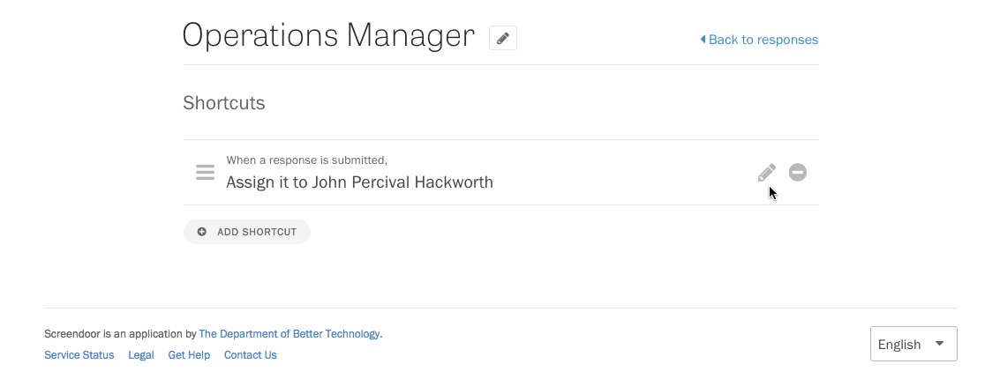
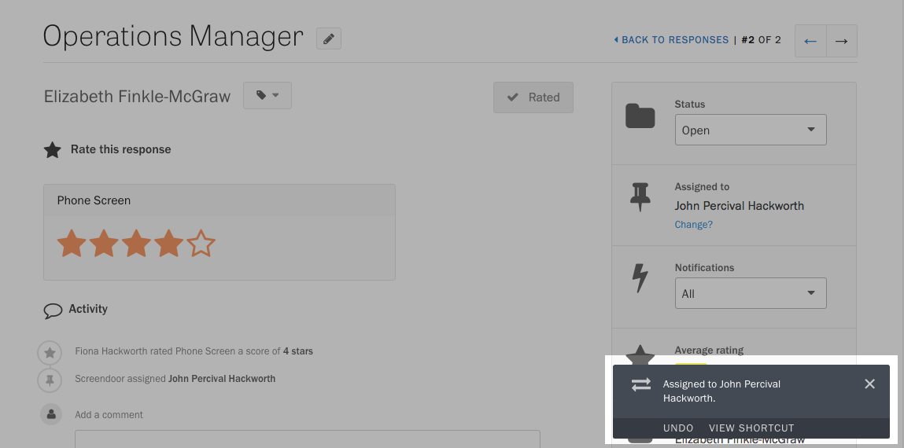
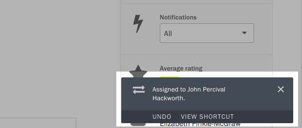
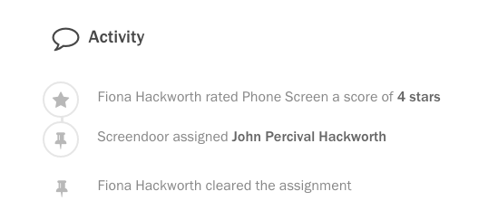

Shortcuts are a foolproof way to automate the existing workflow behind your form. By performing routine, mundane tasks for you, shortcuts can help your team focus on what matters—evaluating responses, following up with respondents, and making smarter decisions, backed by data.

### Creating a shortcut

Go to your project's Responses page and click the Configure shortcuts link in the lower left-hand corner.

Press the Add Shortcut button to configure your first shortcut.

First, you need to add the trigger that will cause this shortcut to run. You can trigger a shortcut when a response is submitted, revised, or rated, or when its status or labels are changed.

Next, choose the action that will take place when the shortcut is triggered.

When you press "Save", you'll see a summary of the shortcut you created. To add additional shortcuts, press the button at the bottom of the page.

### Editing and deleting shortcuts

Edit and Delete buttons appear next to each shortcut. Press the Edit button to change the settings of a shortcut. When you're done configuring the shortcut, press the Save button to save your changes.

Press the Delete button to remove a shortcut.

### Reversing a shortcut

Whenever you trigger a shortcut, a notification appears on the lower right-hand corner of the page. If you have the right permissions the Undo link inside the notification.

All actions related to shortcuts, even those that have been undone, are recorded in the activity feed.

### Understanding a shortcut

If you manage to trigger a shortcut when you aren't expecting it, you might be curious how the shortcut has been configured. If they have the appropriate permissions, it's easy to find out: just press the View Shortcuts link in the shortcut notification, and you will be taken straight to that shortcut in the editor.

