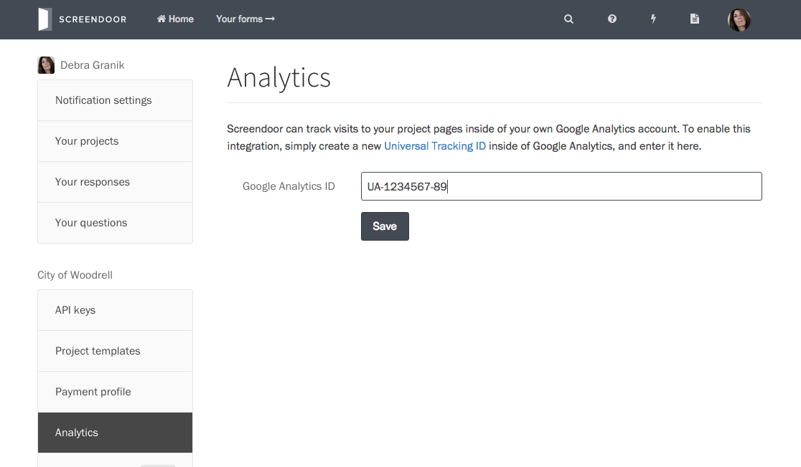

### Connecting Screendoor to Google Analytics

You can connect your Google Analytics account to track visits to your Screendoor project.

To integrate your Google Analytics account with Screendoor, sign into Google Analytics and select "Admin" in the top navigation bar. Select the property you want to track in the second column. Under the "Tracking Info" section, choose "Tracking Code."

Copy the tracking code that appears.

In Screendoor, click on your avatar in the navigation bar, select "Settings" from the dropdown, and choose "Analytics" from the sidebar. Under "Google Analytics ID," paste in your tracking code and press "Save."

---

## F.A.Q.

### What pages are tracked in Google Analytics?

Screendoor tracks events on the following pages:

- [`Forms.fm` landing page for all your projects](../projects/branding_your_forms.html)
- [Project page](../projects/writing_your_project_page.html)
- [Questions page](../questions/configuring_the_question_and_answer_section.html)
- [Response confirmation page](../your_form/confirmations.html)

### The status of my Universal Tracking ID is "Tracking not installed." How do I know if the Google Analytics integration is working correctly?

We use a custom script to send data to Google Analytics. If you have recently added the tracking ID to Screendoor, you will need to wait a few hours for the status to update and for the tracked events to appear in your dashboard.
