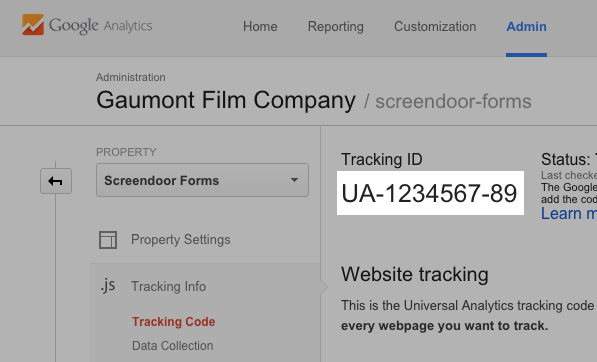

Screendoor lets you use your Google Analytics account to track visits to your Screendoor project.

To integrate your Google Analytics account with Screendoor, sign into Google Analytics and select &ldquo;Admin&rdquo; in the top navigation bar. Select the property you want to track in the second column. Under the &ldquo;Tracking Info&rdquo; section, choose &ldquo;Tracking Code&rdquo;.

Copy the tracking code that appears.

In Screendoor, click on your avatar in the navigation bar, select &ldquo;Settings&rdquo; from the dropdown, and choose &ldquo;Analytics&rdquo; from the sidebar. Under &ldquo;Google Analytics ID&rdquo;, paste in your tracking code and press &ldquo;Save&rdquo;  and then selecting &ldquo;Project templates&rdquo; in the sidebar.

