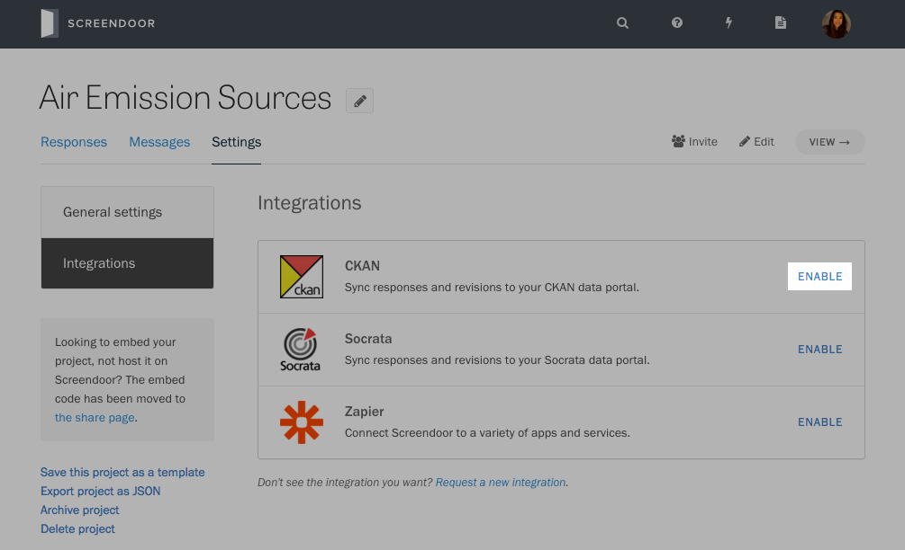
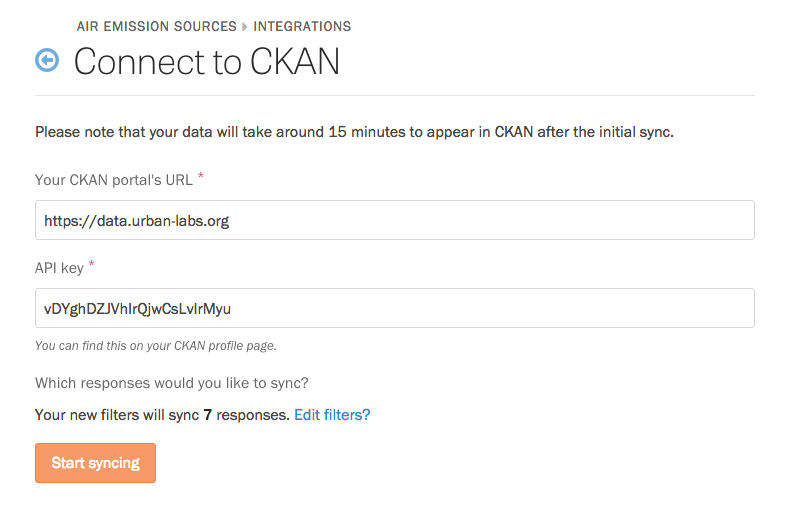
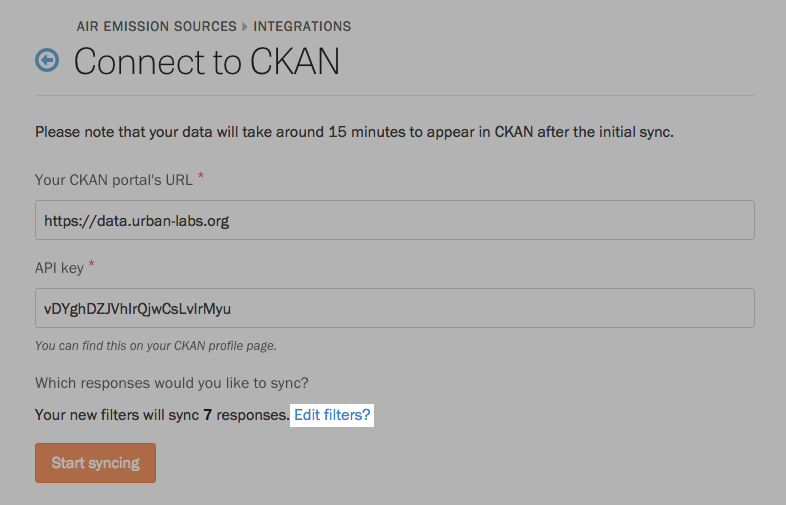
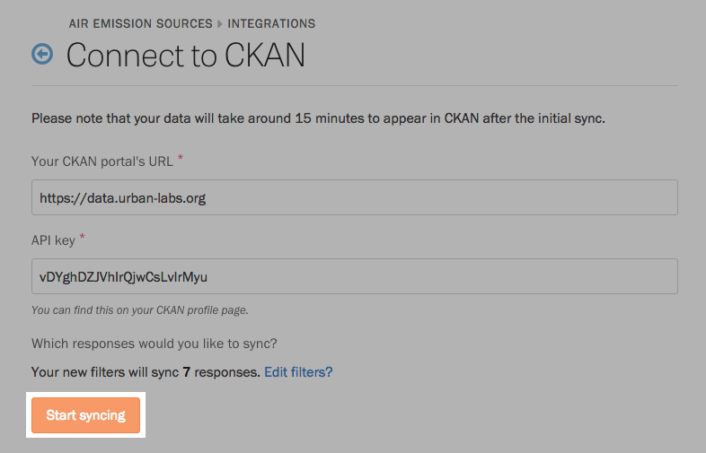

    **Note**: CKAN data sync is only available for Enterprise plans.

Instead of manually releasing open data to your CKAN portal, Screendoor can sync your responses with a CKAN dataset automatically. Revisions to responses can even be reflected in your portal in real time.

### Connecting to CKAN

If you have a CKAN account, visit your project's Settings page, and select "Integrations" from the sidebar. Click "Enable" next to CKAN.

On the Connect to CKAN page, fill in the URL and API key of your CKAN data portal.

### Choosing responses to sync

Screendoor will sync all responses by default. To sync only a subset of your responses, click "Edit filters?"

In the modal that appears, you can choose to filter responses with a specific status or label or those that contain a certain word or phrase. Press the "Filter responses" button to save your filters.

Finally, to start syncing the responses that match your filters, press the "Start syncing."

