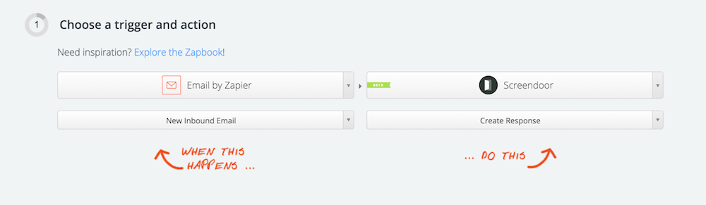
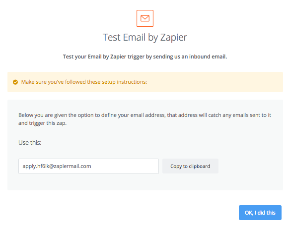
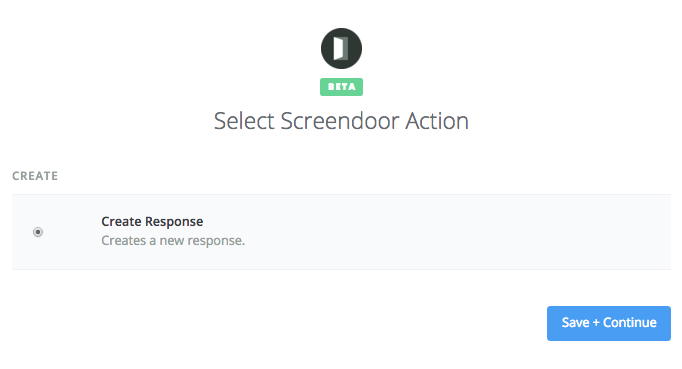
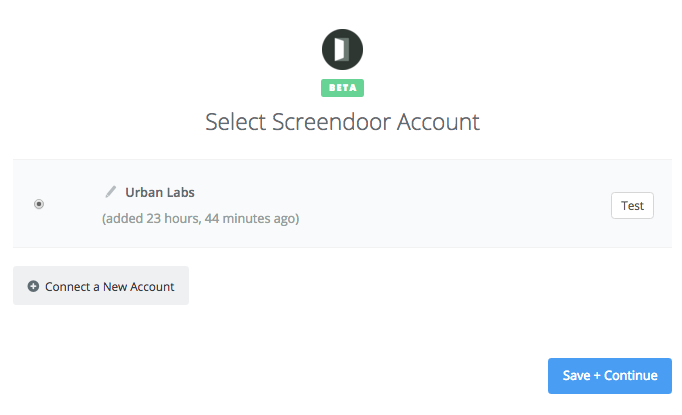
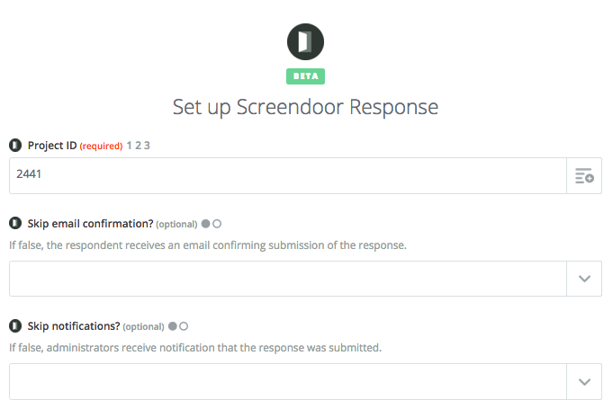
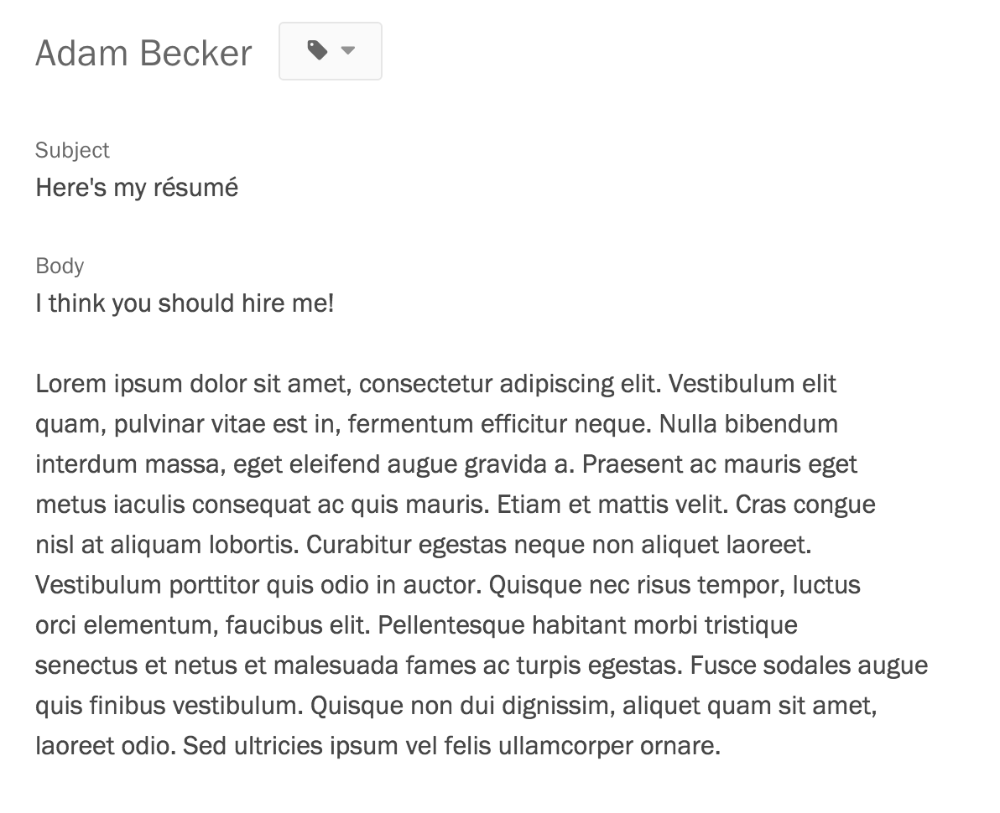
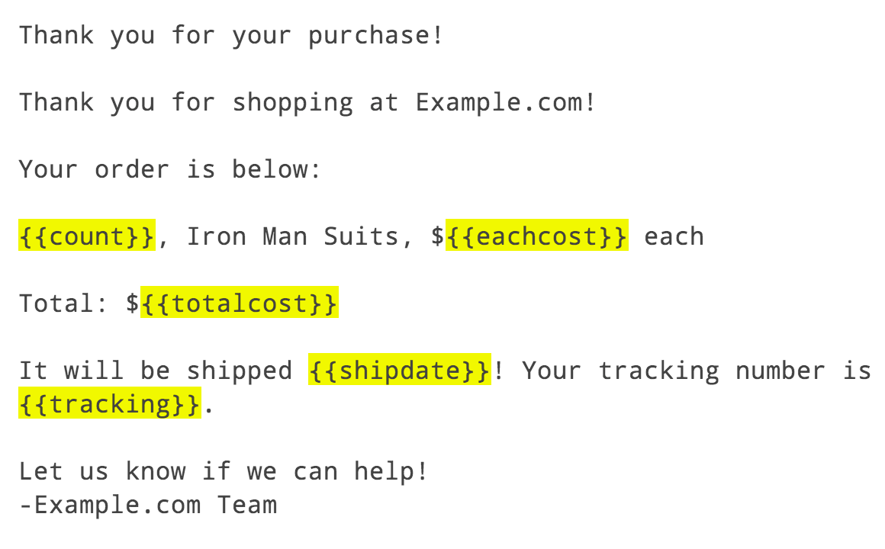

In some cases, you might wish to let respondents submit to your project through email. By using Zapier, you can configure this integration without writing a line of code.

### Getting started

First, follow the instructions to [connect your Zapier account to Screendoor](/articles/screendoor/integrations/zapier.html).

Ensure that your Screendoor project has at least two form fields, one for the email's subject line and another for its body.

Next, from Zapier's homepage, click the "Make a New Zap" button. For the trigger, select the app "Email by Zapier" with the action "New Inbound Email." For the action, choose the app "Screendoor" and the action "Create Response":

Then, create an email address that will be used to forward emails to Screendoor:

Go ahead and send a test email to this address -- this will help us test the Zap in the next few steps.

Next, you must enter your Screendoor Project ID and press the "Try again?" button next to the message saying that Zapier had trouble loading fields. (Sometimes Zapier has trouble loading Screendoor form fields. If this happens, refreshing the webpage usually resolves the issue.)

Finally, you must map the fields from an incoming email to the form fields in your Screendoor project. If your form fields are called "Subject" and "Body," you'll want to configure the Zap to look like this:

You may use the "Test this Zap" section to verify that your Zap is working, and press the "Turn Zap on" button at the bottom of the page.

You're all set! Now, when a respondent sends an email to the address that you created, it will show up as a response inside of Screendoor.

  

    
  

  

    
  

### Advanced parsing of incoming emails

While the above instructions will copy the entire subject line and body from incoming emails, the [Parser by Zapier](https://parser.zapier.com/) service allows you to extract structured data from incoming emails. This can be an extremely powerful tool when used wisely!

