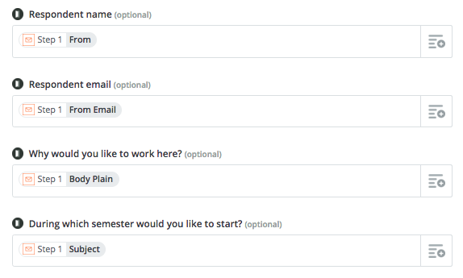
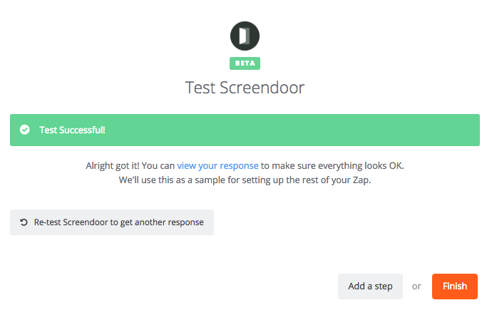

In some cases, you might wish to let respondents submit to your project through email. By using Zapier, you can configure this integration without writing a line of code.

### Getting started

First, follow the instructions to [connect your Zapier account to Screendoor](/articles/screendoor/integrations/zapier.html).

Ensure that your Screendoor project has at least two form fields, one for the email's subject line and another for its body.

Next, from the Zapier dashboard, click the "Make a New Zap" button. For the trigger, select the app "Email by Zapier" and press "Continue."

Then, create an email address that will be used to forward emails to Screendoor:

Go ahead and send a test email to this address — this will help us test the Zap in the next few steps.

For the action, choose the app "Screendoor." The "Create Response" action will be selected for you automatically. Press "Save + Continue."

Since you've already connected Screendoor to Zapier, your Screendoor account will appear on the "Select Screendoor Account" page. Press "Save + Continue."

Next, on the "Set up Screendoor Response" page, enter your Screendoor Project ID and press "Continue."

In the next step, you will be asked to test Screendoor. Sometimes Zapier has trouble loading Screendoor form fields. If this happens, press "Try again."

Once the test succeeds, you must map the fields from an incoming email to the form fields in your Screendoor project before pressing "Continue."

On the next page, you can choose to test your Zap.

Then press "Finish" and turn on your Zap. You're all set! Now, when a respondent sends an email to the address that you created, it will show up as a response inside of Screendoor.

  

    
  

  

    
  

### Advanced parsing of incoming emails

While you can copy the entire subject line and body from incoming emails by following the steps above, the [Parser by Zapier](https://parser.zapier.com/) service allows you to extract structured data from incoming emails. This can be an extremely powerful tool when used wisely!

