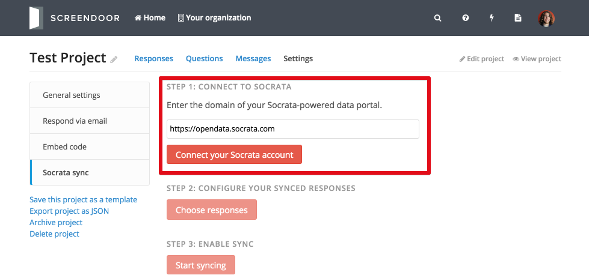
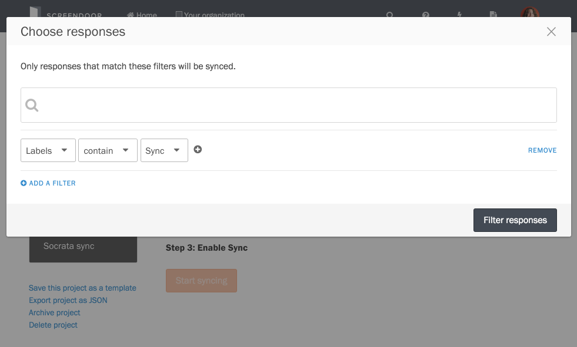
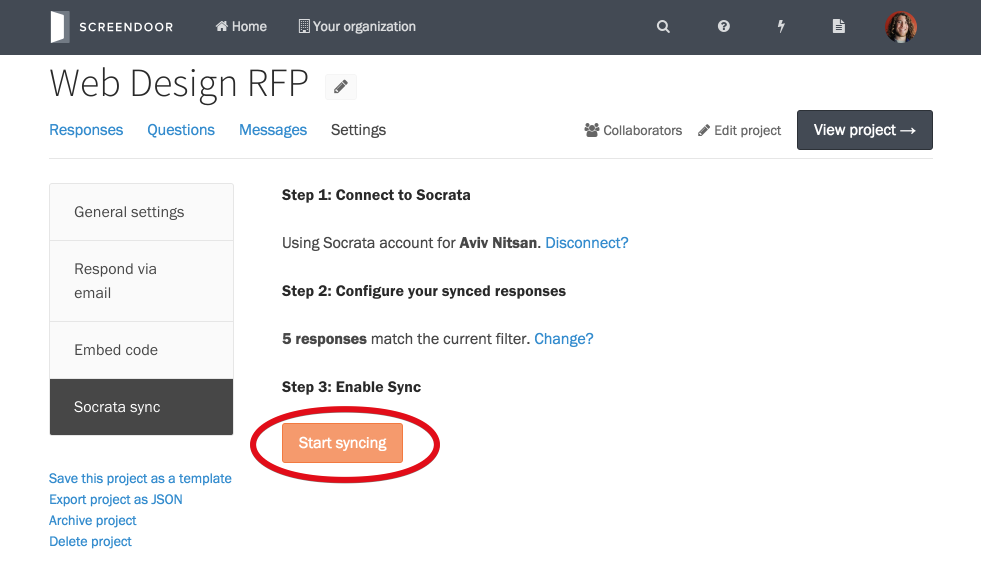

    **Note**: In order to use Socrata data sync, you'll need to sign up for an Enterprise plan.

Screendoor makes it easy to passively sync responses to a Socrata dataset.

  <iframe width="640" height="360" src="https://www.youtube.com/embed/gRVwX2q6i2w?rel=0&amp;showinfo=0" frameborder="0" allowfullscreen></iframe>

## Connecting to Socrata

To sync with Socrata, first you'll need to make sure you have a Socrata account. Then, click "Socrata sync" from the "Settings" page for your project.

Fill in the web address of your Socrata data portal and click "Connect your Socrata account." You'll be redirected to the Socrata sign-in page (unless you're already signed in). Sign in to Socrata and click the "Allow" button to finish connecting to Socrata and go back to Screendoor.

## Choosing responses to sync

Click the "Choose responses" button to choose which responses you'd like to sync to Socrata. Then, enter a search query and/or add custom filters. For example, if you only want to sync responses with a specific status or label, click "Add filter" and select the appropriate options from the dropdowns. If you're not sure how to filter the responses you want, see the [Advanced Search](/articles/screendoor/responses/sorting_and_filtering_responses.html#advanced-search) section.

To sync all responses, just leave everything blank.

Click "Filter responses" and you'll see how many responses match your filters.

## Enabling Socrata sync

If everything looks good, click "Start syncing" to enable Socrata sync

That's all there is to it: the responses you selected will be automatically synced to Socrata! If any new responses are submitted that match your filters, they'll be added to your Socrata dataset. If you edit or delete responses, they'll get modified or deleted in Socrata as well.
