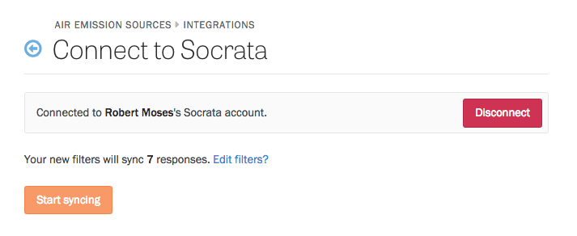

    **Note**: Socrata data sync is only available for Enterprise plans.

Instead of manually releasing open data to your Socrata portal, Screendoor can sync your responses with a Socrata dataset automatically. If you have Socrata sync enabled, revisions to responses will even be reflected in Socrata in real time. It helps your team become more transparent, without the administrative overhead.

### Connecting to Socrata

If you have a Socrata account, visit your project's Settings page and select "Integrations" from the sidebar. Click "Enable" next to Socrata.

Fill in the URL of your Socrata data portal and press the "Connect to Socrata" button.

### Choosing responses to sync

Once you have connected to Socrata, press the "Add filters" button.

A modal will appear that allows you to filter the responses that will be sent to Socrata. For example, you can choose to only sync responses with a specific status or label. To sync all responses to your project, leave everything in the modal blank. Press the "Filter responses" button to save your filters.

Finally, to start syncing the responses that match your filters, press "Start syncing."

