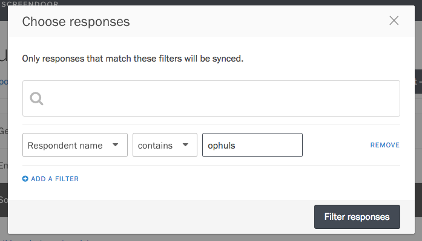
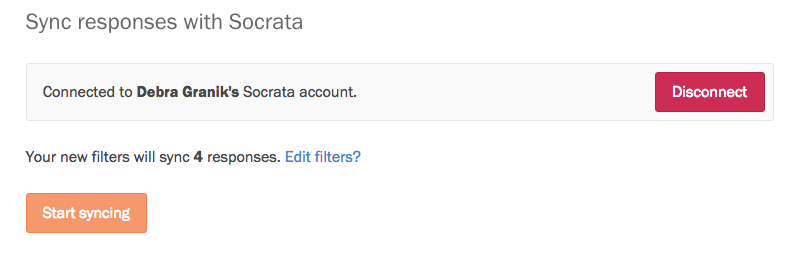

    **Note**: Socrata data sync is only available for Enterprise plans.

Instead of manually releasing open data to your Socrata portal, Screendoor can sync responses to your forms with a Socrata data set automatically. If you have Socrata sync enabled, revisions to responses will even be reflected in Socrata in real time. It helps your team become more transparent, without the administrative overhead.

### Connecting to Socrata

If you have a Socrata account, visit your project's Settings page, and select "Socrata sync" from the sidebar.

Fill in the web address of your Socrata data portal and press the "Connect to Socrata" button. If you're already signed in, you will be asked whether you want to connect to Screendoor. Press the "Allow" button to complete the process.

### Choosing responses to sync

Once you have connected to Socrata, press the "Add filters" button. A modal will appear that allows you to filter the responses that will be sent to Socrata. For example, you can choose to only sync responses with a specific status or label. To sync all responses to your project, leave everything in the modal blank.

Press the "Filter responses" button to save your filters. The page will update, telling you how many responses will be synced.

To start syncing to Socrata, press the "Start syncing" button.
