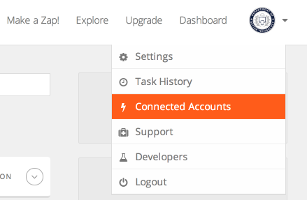
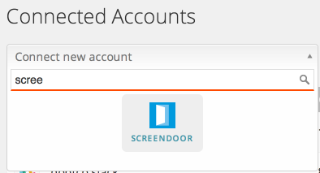
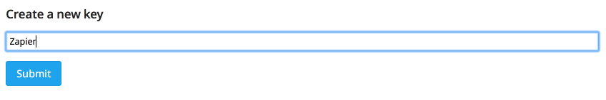
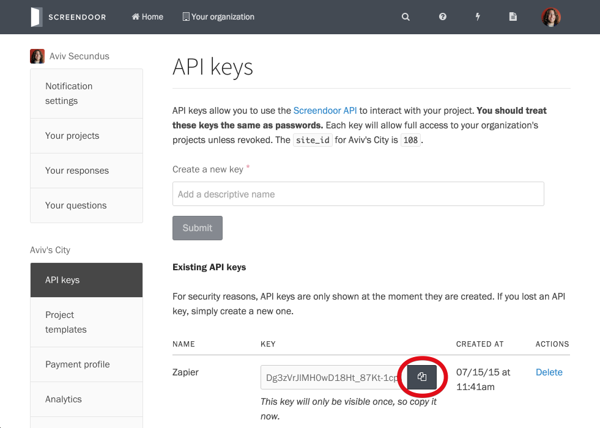
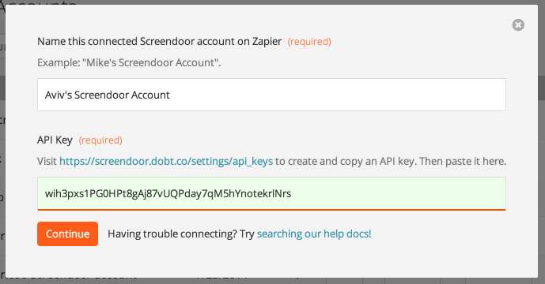
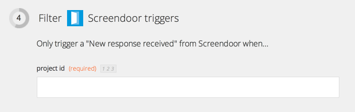
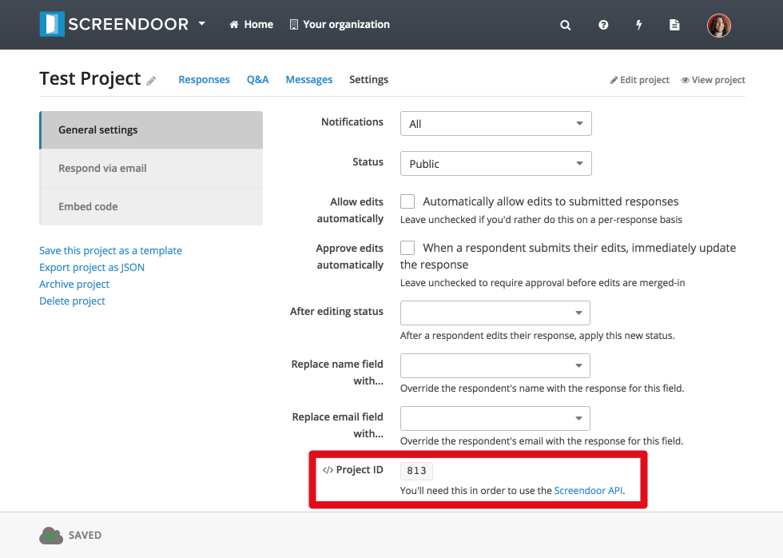

    **Note:** Screendoor is currently "invite-only" on Zapier. You will have to [accept our invitation](https://zapier.com/developer/invite/11164/f7c39187582faf14fb803d66cc8500b7/) before connecting your account.

Zapier is a service that allows you to define automated integrations between a variety of apps and services. Using Zapier, you can automate your workflow and integrate Screendoor triggers with many of the [apps](https://zapier.com/zapbook/) registered with Zapier.

## Getting started with Screendoor on Zapier

    **Note**: In order to use Zapier with Screendoor, you must have [permission](/articles/your_account/accounts/managing_users.html#managing-user-permissions) to manage API keys for your Organization.

To get Screendoor working with Zapier, the first thing you'll need to do is connect your Screendoor account. Select "Connected Accounts" from the Zapier menu to get started.

Click "Connect new account" and select "Screendoor."

Next, enter a name for your Screendoor account (this is just for your own reference, so call it whatever you want).

To connect your Screendoor account, you'll need to [create an API key from Screendoor](https://screendoor.dobt.co/settings/api_keys). Enter "zapier" for the API key name, and click "Submit" to create your Screendoor API key.

After you create your key, copy it by clicking the "Copy to clipboard" icon.

Paste this API key into Zapier and click "Continue."

Zapier will test your API key to make sure it's working. If you get an authorization error at this point, make sure you've entered your API key correctly.

That's it! Your Screendoor account is now connected to Zapier, which means you can use Screendoor triggers in your zaps.

---

## F.A.Q.

### Why do I have to enter a project ID when I create a zap?

When creating a zap, you'll have to enter the Screendoor project ID for the project you'd like to integrate with. This is so Zapier knows which Screendoor project to interact with. Note that each zap has its own associated Screendoor project.

You can find your project ID on your project's settings page. Click "Show advanced settings" to show your project ID.

