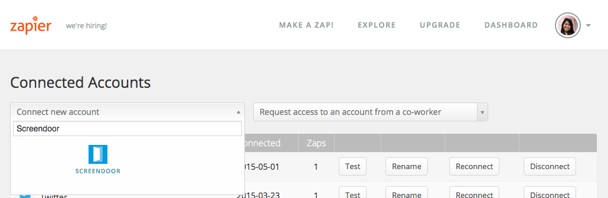
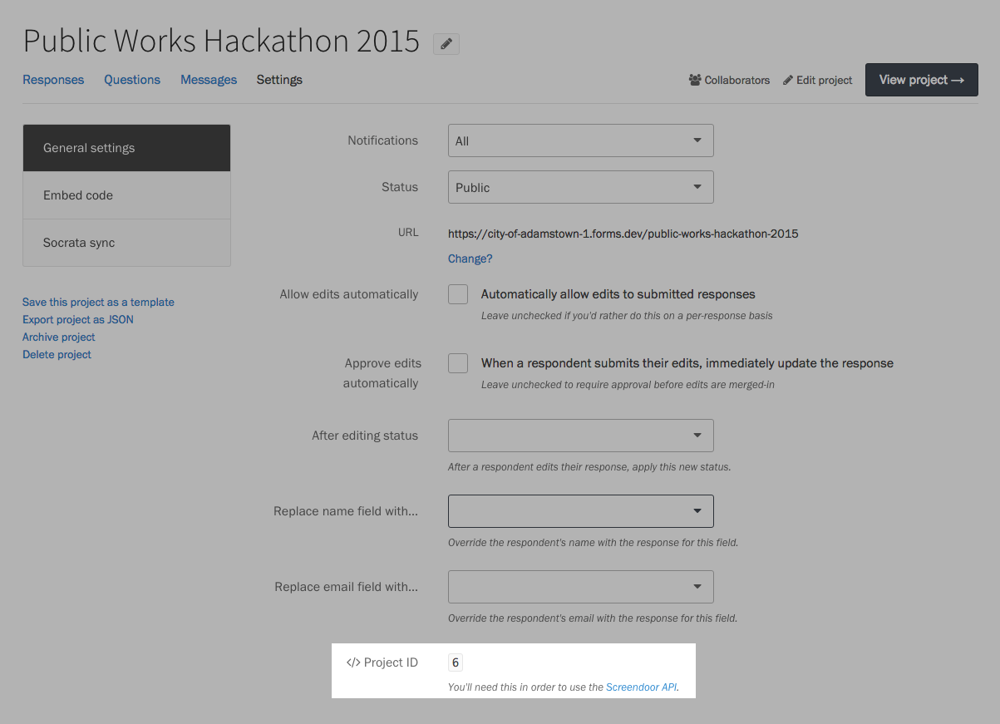

Zapier is a product that allows you to automate your workflow by providing a connecting bridge between a variety of apps and services. If you have a Zapier account, you can use Screendoor's triggers to add great integrations with the [apps](https://zapier.com/zapbook/) your team uses regularly.

For example, the DOBT team onboards new employees with a Screendoor form. Once they have submitted their form, we use Zapier to post a welcome message to [Slack](http://www.slack.com):

### Connecting Screendoor to Zapier

Before you get started, make sure you have [permission](/articles/your_account/dashboard/managing_users.html#managing-user-permissions) to manage Screendoor's API keys. Click on your avatar in the navigation bar, and select "Settings" from the dropdown.

If you can see "API keys" as an option in the sidebar, your first step is to create an API key with which Zapier can connect to Screendoor. Create an API key with a name of "Zapier," and copy it.

If you can't find an API keys page on Screendoor, ask your account administrator to give you the proper permissions.

Because Screendoor is not publicly listed as a Zapier application, you'll need to accept our invitation.  Press the button below to do so.

<a class="button info" href="https://zapier.com/developer/invite/11164/f7c39187582faf14fb803d66cc8500b7/">Get invited to use Screendoor on Zapier</a>

You can also accept our invite from within your project. Visit your project's Settings page, select "Integrations" from the sidebar, and click "Enable" next to Zapier.

Then, click "Accept invite to use Screendoor on Zapier."

In Zapier, click on your avatar in the upper right corner, and select "Connected Accounts."

Click on dropdown and search for Screendoor. Click on "Screendoor" in your search results.

Under "API key," paste in the key you generated earlier.

Zapier will test your API key to make sure it's working. If you receive an authorization error, make sure you entered the API key correctly.

Once your API key is authorized, Screendoor will appear in the list of connected accounts.

### Using Zapier with Screendoor

A "Zap" is a link between the apps you've connected to your Zapier account. Any Zap that includes Screendoor needs to be connected to a specific project. In the process of creating a Zap, Zapier will ask you for your Screendoor project's ID.

You can find your project ID on its Settings page, under "General settings." Click the "Show advanced settings" link, and scroll to the bottom.

### Configuring Multi-step Zaps

Zapier now lets you automate multiple actions with a single Screendoor trigger. You can, for example, configure a Zap to add a respondent as a subscriber to your Mailchimp mailing list *and* create a card for their response in your Trello board. [Read more about multi-step Zaps.](https://zapier.com/multi-step-zaps/)

