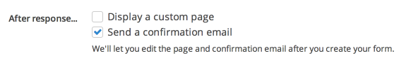

It's easy to set up Screendoor to automatically send confirmation emails whenever a response is submitted. First, check the "Send a confirmation email" checkbox from the "Responses" page of the Project Checklist.

Then, write your confirmation email in the "After response email" step of the Project Checklist.

- Tip: You can also insert a variety of useful respondent-specific variables (for example, the respondent's name) by clicking the curly braces icon and selecting the variable you would like to insert.

That's it! Your custom confirmation email will now be sent automatically to respondents whenever they successfully submit a response.
