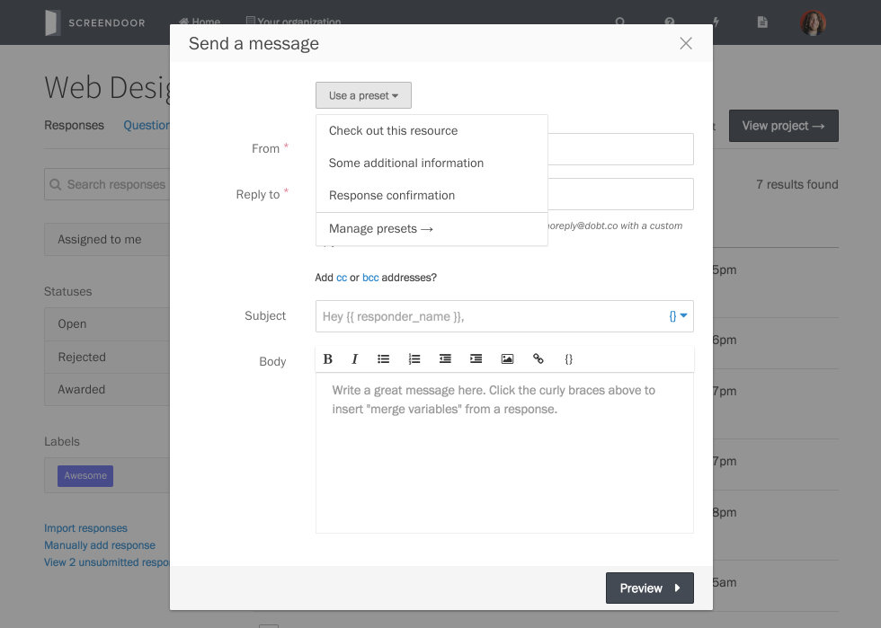

Message presets allow you to define a canned message once and send it as many times as you'd like.

## Creating message presets

To create a preset, click the "Manage presets" link from the "Messages" page. Then, click the "Add a preset" button. Write your message preset (optionally using respondent-specific variables) just as you would write a normal message. Click "Save" to save your preset message.

## Using message presets

Once you've defined your preset message, you can quickly send it to respondents as many times as you like: simply select respondents from the "Responses" page, select "Write message" from the "More" dropdown, and click "Craft your message." Then, click "Use a preset" and select your preset from the dropdown. That's it! Preview your messages and click "Send messages" to send your canned message to the respondents you selected.

