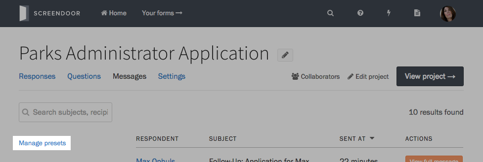
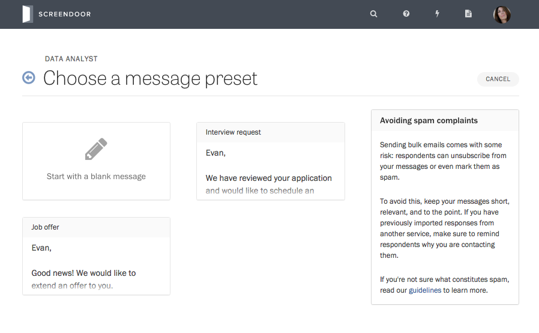

If you send the same types of messages repeatedly for a project, message presets let you create canned messages to reuse later.

### Creating a message preset

To create a preset, visit the Messages page for your project, and click the &ldquo;Manage presets&rdquo; link on the lower left-hand side of the page.

Then, select the &ldquo;Add a preset&rdquo; button on the upper right-hand side of the page.

Write your preset just like you would write a normal message. ([Learn more about composing messages in Screendoor.](sending_messages.html)) Once you're finished, press the Save button.

### Using your preset

You can send message presets to respondents with just a few clicks. When composing a message, click the &ldquo;Use a preset&rdquo; button, and select your preset from the dropdown.

