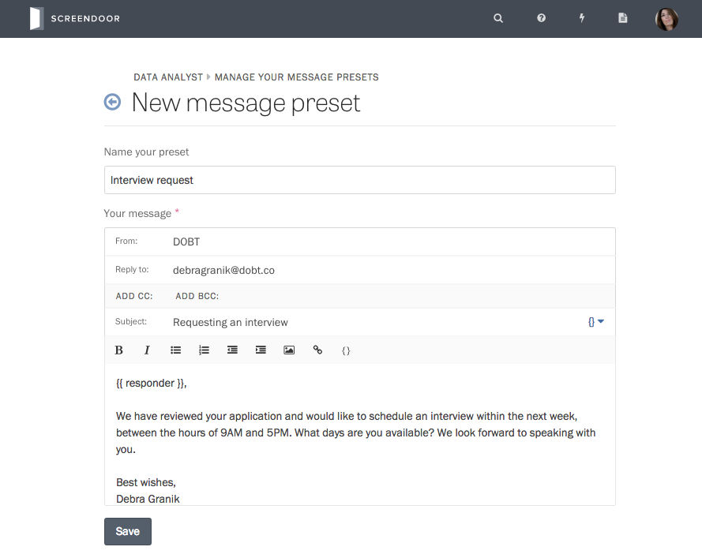

If you send the same types of messages repeatedly for a project, you can create canned messages or "message presets" to reuse later.

### Creating a message preset

To create a preset, visit the Messages page for your project, and click the "Manage presets" link on the lower left-hand side of the page.

Then, select the "Add a preset" button on the upper right-hand side of the page.

Write your preset just like you would write a normal message. ([Learn more about composing messages in Screendoor.](sending_messages.html)) Once you're finished, press the Save button.

### Using your preset

Whether you want to get in touch with one respondent or several respondents at once, you can create a message from one of your presets.

