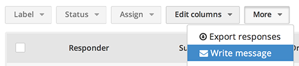

## Sending messages

Screendoor makes it easy to batch-send messages to your respondents. If you'd like to send a message to all your respondents, just click "Write message" under the "More" dropdown above the "Responses" table.

Make sure the "All" checkbox is selected, and then click the "Craft your message" button. Enter a reply-to email, a subject, and a body for your message. After you have written your message, click "Preview" to make sure everything looks the way it should. If the preview looks good, click "Send messages" to send your message.

- Tip: You can also insert a variety of useful respondent-specific variables (for example, the respondent's name) by clicking the curly braces icon and selecting the variable you would like to insert. 

## Sending messages to specific respondents

If you'd prefer to send a message only to specific respondents, you can check those respondents from the "Responses" table. Then, make sure the "Checked" checkbox is selected in the "Send a message popup" and click "Craft your message." Alternatively, you can apply whichever [filters](../responses/sorting_and_filtering_responses.html) you'd like before you click "Write message." Then, select the "Current search results" checkbox in the "Send a message" popup before crafting your message.

## Reviewing sent messages

You can review all the messages you have sent by clicking the "Messages" link for your project. Click the "View sent message" button to review a previously sent message. Note that this is a new feature, and that there may not be records for older messages.

## Message presets

To use message presets, which allow you to quickly send canned replies to your respondents, check out the [message presets](presets.html) article.
