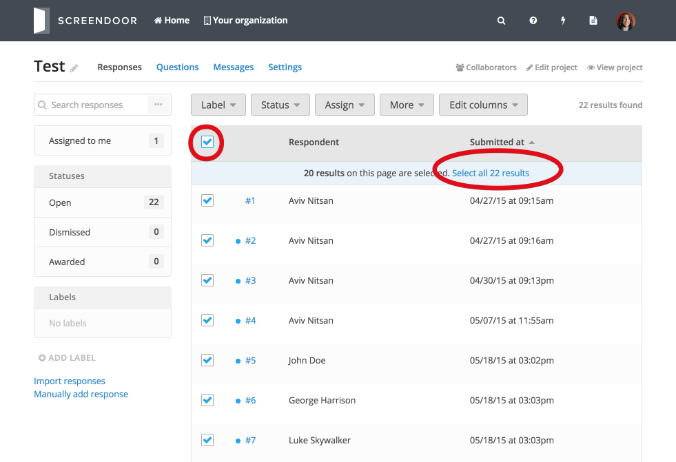
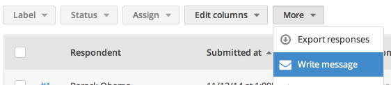

## Sending messages to all your respondents

If you'd like to send a message to all your respondents, check the topmost checkbox in the "Responses" table. If you have more than one full page of responses, click the "Select all results" link to select all of your responses.

Select "Write message" from the "More" dropdown.

Enter a reply-to email, a subject, and write your message!

> **Note**: You can also insert a variety of useful respondent-specific variables (for example, the respondent's name) by clicking the curly braces icon and selecting the variable you would like to insert.

Then, click "Preview" to make sure everything looks good. Click "Send messages" to send your message to all your respondents.

## Sending messages to specific respondents

If you'd prefer to send a message only to specific respondents, just check the box next to those respondents from the "Responses" table and select "Write message" from the "More" dropdown.

## Reviewing sent messages

You can review all the messages you've sent by clicking the "Messages" link for your project. Click the "View sent message" button to review a previously sent message. Note that this is a new feature, and that there may not be records for older messages.

## Message presets

To use message presets, which allow you to quickly send canned replies to your respondents, check out the [Message presets](presets.html) article.
