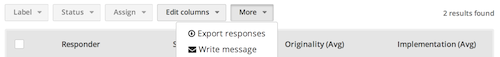
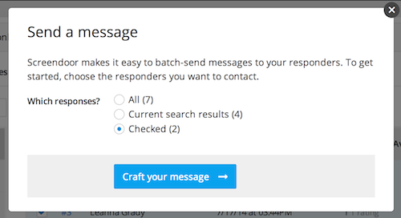

## Sending messages

Screendoor makes it easy to batch-send messages to your responders. If you'd like to send a message to all your responders, just click "Write message" under the "More" dropdown above the "Responses" table. Make sure the "All" checkbox is selected, and then click the "Craft your message" button. Enter a reply-to email, a subject, and a body for your message. After you have written your message, click the "Preview" to make sure everything looks the way it should. If the preview looks good, click "Send messages" to send your message. You'll see the blue progress bar move forward as Screendoor queues and sends your messages.

- Tip: You can also insert a variety of useful responder-specific variables (for example, the responder's name) by clicking the "Insert variable" link and selecting the variable you would like to insert.

## Sending messages to specific responders

If you'd prefer to send a message only to specific responders, you can simply check the responders you'd like to send a message to from the "Responses" table. Then, make sure the "Checked" checkbox is selected in the "Send a message popup" and craft your message, which will only be sent to the responders you selected. Alternatively, you can apply whichever [filters](../responses/sorting_and_filtering_responses.html) you'd like before you click "Write message." Then, simply select the "Current search results" checkbox in the "Send a message" popup before crafting your message.

## Reviewing sent messages

If you want to go back and edit your message, click "Edit." You can also review all the messages you have sent by clicking the "Messages" link for your project.

