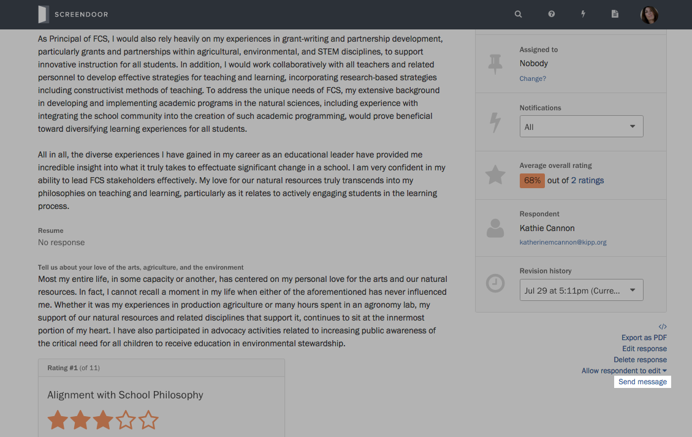
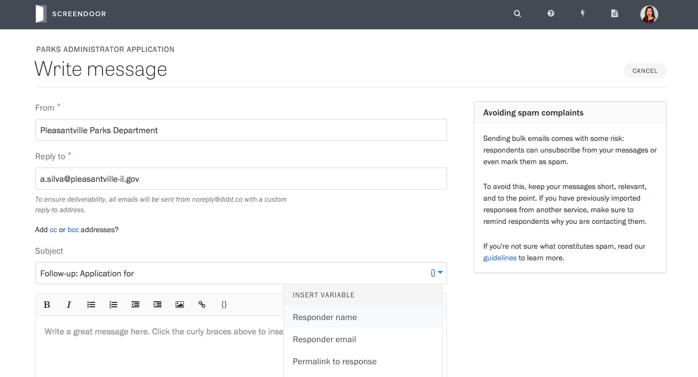

### Sending messages in bulk

Screendoor lets you send bulk messages to your respondents. You can use messages to follow up on promising responses for more information, send rejection letters in bulk, and more.

To start, visit the Responses page for your project and check the responses you would like to send messages to. Press the &ldquo;More&rdquo; button and select &ldquo;Send message&rdquo; from the dropdown.

Enter a reply-to address, a subject line, and your message on the page that appears.

### Using variables

Message variables allow you to customize each message for the person you're sending it to, providing specific and valuable information.

As an example, let's insert the respondent's name into the subject line for a customized greeting and inform them of the current status of their response in the message body.

Press the blue brackets link on the right side of the subject line input to insert a variable. We'll select &ldquo;Respondent name&rdquo; from the dropdown.

Then, we'll write our message as we normally would. When it's time to insert the status, we'll select the same brackets icon at the top of the text editor, and select &ldquo;Response status.&rdquo;

Once your message is finished, you can preview it before you send it, giving you a chance to confirm that the variables are formatted correctly.

  **Note**: We automatically add a brief header and footer to each message to ensure deliverability and to give respondents the option to unsubscribe from future messages.

